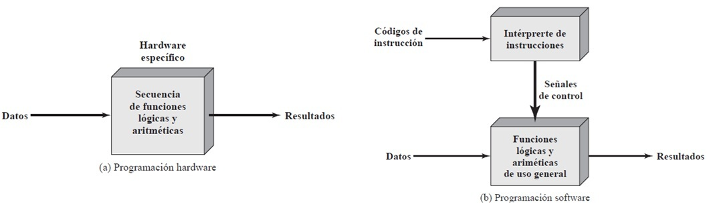
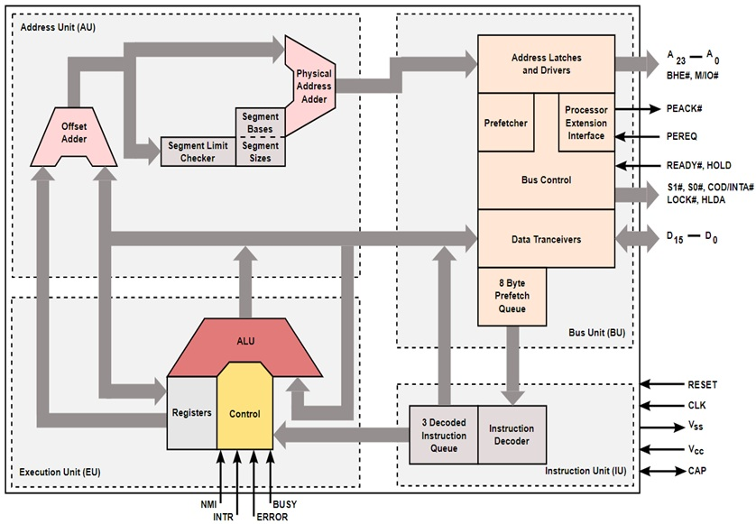
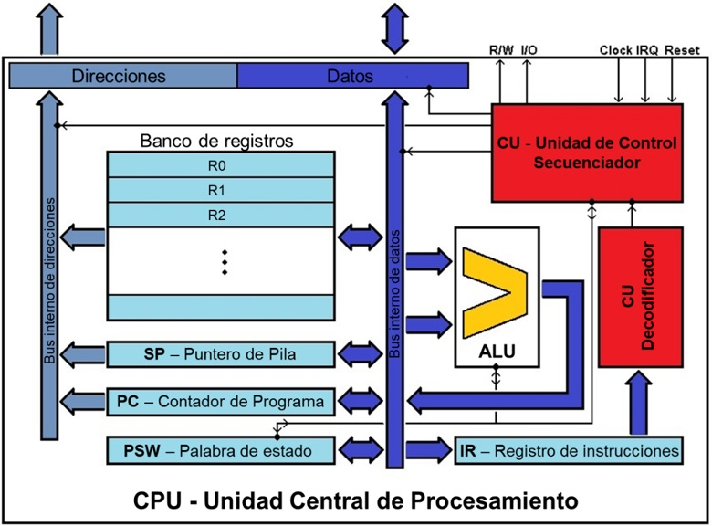

# Introducción a la Arquitectura de Computadores

## Índice
1. [Introducción](#1-introducción)
2. [Estructura de un computador: enfoque multinivel](#2-estructura-de-un-computador-enfoque-multinivel)
3. [Organización y funcionamiento de la CPU](#3-organización-y-funcionamiento-de-la-cpu)
4. [El repertorio de instrucciones (ISA)](#4-el-repertorio-de-instrucciones-isa)
5. [El rendimiento de un computador](#5-el-rendimiento-de-un-computador)
6. [La memoria](#6-la-memoria)
7. [Interrupciones](#7-interrupciones)
8. [Dispositivos de Entrada/Salida](#8-dispositivos-de-entradasalida)
9. [Bibliografía](#bibliografía)

## 1. Introducción
En 1945 John Von Neumann publicó un modelo de arquitectura de computador que sigue hoy en día siendo la base de la mayor parte de las arquitecturas de computador actuales.

La **arquitectura Von Neumann** distingue tres **bloques funcionales** fundamentales:

*   **El procesador o CPU (Central Processing Unit)**
    
    Ejecuta los programas.

*   **La memoria**

    Contiene **datos** que pueden ser leídos y escritos.

    *   los **datos** son:
        
        * **valores**, que pueden representar entidades como peso, volumen, sueldo, velocidad, cantidades, nombres, fechas, etc. e, incluso, **direcciones de memoria**.

        *  **instrucciones**, órdenes que indican al procesador qué operación realizar. Al igual que los valores, están ubicadas en posiciones específicas de la memoria identificadas por direcciones.

*   **Dispositivos de entrada/salida**

    Suministran al computador los datos que debe procesar y reciben los resultados.

Estos bloques funcionales se interconectan a través del **bus del sistema**, conjunto de conductores eléctricos que transmiten:

* las **direcciones** de memoria para acceder a los datos,
* los propios **datos** y
* las **señales de control**.

{: style="display: block; margin: 0 auto" }

<em>Figura 1.1 - Bloques funcionales de la arquitectura Von Neumann. <small>(Fuente: <a href="https://es.wikipedia.org/wiki/Arquitectura_de_Von_Neumann">https://es.wikipedia.org/wiki/Arquitectura_de_Von_Neumann</a>)</small></em>

 

Las características fundamentales de la **arquitectura Von Neumann** son:

1.	Valores e instrucciones se almacenan en la misma memoria (**programa almacenado**). 
2.	El contenido de la memoria se organiza en **celdas**, que son accesibles (lectura y escritura) proporcionando una **dirección**.
3.	La **ejecución** de los programas se realiza por defecto de forma **secuencial**, una lista consecutiva de **instrucciones** que se ejecutan una tras otra.

!!! note "El *cuello de botella* de Von Neumann"
    Valores e instrucciones comparten el **bus de datos** para ser transferidos a la CPU. Como consecuencia, el procesador no puede acceder simultáneamente a las instrucciones y a los valores, lo que genera una restricción en el rendimiento conocida como el **cuello de botella de Von Neumann**. En la práctica, esto significa que la velocidad del sistema está limitada por el ancho de banda del bus de memoria, que suele ser mucho más lento que la velocidad de procesamiento de la CPU.

!!! info "Aclaración terminológica: ¿Las instrucciones son datos?"
    Encontrarás que la bibliografía (este documento no es una excepción) a veces usa el término **datos** de dos formas distintas:

    1.  **Sentido amplio (Concepto de Programa Almacenado):** Bajo la arquitectura Von Neumann, **todo son datos**. Tanto las instrucciones como los valores son simplemente secuencias de bits almacenadas en la misma memoria. En este sentido, una instrucción *es* un dato más. Acabamos de ver que por el **bus de datos** circulan valores e instrucciones.
    
    2.  **Sentido estricto (Ciclo de ejecución):** Cuando se describe el funcionamiento de la CPU, se suele distinguir entre **instrucciones** (el código de operación que dice qué hacer) y **datos** (los valores o operandos sobre los que actúa la instrucción). 

    **En resumen:** Aunque físicamente en la memoria no hay diferencia (todo son bits), funcionalmente los separamos para entender qué es la *orden* (instrucción) y qué es el *operando* (dato) sobre el que actúa esa orden.

### 1.1 Programación cableada frente a programación software
#### Programa cableado
Mediante la combinación de componentes lógicos electrónicos es factible recrear funciones que, a partir de unos datos de entrada, permitan obtener las salidas correspondientes. El proceso de diseño y posterior interconexión de estos componentes para lograr efectuar un cálculo **determinado** es de hecho una forma de programación, es un **programa cableado**.
#### Programa software
Para dotar de un **propósito general** a un dispositivo, la alternativa es utilizar una combinación de componentes que implementen diversas **operaciones básicas** lógico/aritméticas. Esto permite ejecutar diferentes funciones según se apliquen diferentes señales de control sobre los datos de entrada.

Se asocia a cada operación básica un **código** y se añade un hardware que, en función del código recibido, genera las señales de control asociadas. Para recrear un cálculo o **algoritmo** determinado, basta determinar la **secuencia de códigos** adecuada. Esta secuencia de códigos o **instrucciones** es el **programa software**.

{: style="display: block; margin: 0 auto" }

<em>Figura 1.2 - Programación cableada frente a programación software. <small>(Fuente: W. Stallings. Organización y arquitectura de computadores, pág. 59)</small></em>

 

Las dos cajas mostradas en la figura 1.2.b se corresponden con la **CPU**: bloque funcional formado por el intérprete de instrucciones, la **Unidad de Control** (**CU**), y el módulo de uso general que implementa las funciones aritméticas y lógicas, la **Unidad Aritmético Lógica** (**ALU**).

Faltan dos elementos esenciales para que el sistema software pueda funcionar:

* **Módulo de Entrada/Salida**: los datos e instrucciones deben introducirse en el sistema con algún componente que transforme los formatos de entrada a los formatos que utilice el sistema. Del mismo modo, los resultados deben poder ser accesibles desde el exterior.
* **La memoria principal**: es un componente que en la arquitectura Von Neumann sirve de almacén tanto de las instrucciones como de los valores durante la ejecución del programa. Aunque, a priori, sería factible para cálculos simples proporcionar secuencialmente las instrucciones y valores según se vayan ejecutando (es lo que se hace formalmente con una calculadora de bolsillo), de forma general, un cálculo complejo no siempre ejecutará las instrucciones siguiendo la secuencia predeterminada, pudiendo hacer **saltos** hacia adelante y hacia atrás. Además, durante el proceso pueden generarse operandos intermedios que se utilizarán más adelante y que, por tanto, necesitan ser almacenados temporalmente. 

 

---

## 2. Estructura de un computador: enfoque multinivel

{: style="display: block; margin: 0 auto" }

<em>Figura 2.1 – Enfoque multinivel de un computador <small>(Fuente: A. Tanembaum. Organización de computadoras. Un enfoque estructurado, pág. 5)</small></em>

 

El enfoque multinivel considera al computador estructurado en niveles.

### 2.1 Nivel 0: Lógica digital
Es el hardware de la máquina, donde encontramos **compuertas lógicas** formadas por transistores y las líneas eléctricas que las conectan. Las compuertas lógicas son circuitos digitales que implementan funciones booleanas, es decir, funciones con entradas y salidas en el conjunto de valores {0, 1}. Ejemplos básicos son las compuertas que implementan las operaciones AND y OR.

#### Tablas de verdad
El funcionamiento de un tipo de compuerta se modela por su **tabla de verdad**: nos muestra la salida de la compuerta para cada combinación de entradas posible. En general, para una función booleana de $n$ entradas tenemos una tabla de $2^n$ filas.

{: style="display: block; margin: 0 auto" }

<em>Figura 2.2 – Compuerta lógica AND formada por transistores <small>(Fuente: <a href="https://es.wikipedia.org/wiki/Puerta_lógica">https://es.wikipedia.org/wiki/Puerta_lógica)</a></small></em>

 

### 2.2 Nivel 1: Microarquitectura
Detalla cómo están conectados e interactúan entre sí los dispositivos del nivel 0 y como se organizan formando unidades funcionales. Aquí se decide qué señales de control se utilizarán, las interfaces con los dispositivos de E/S, las tecnologías de memoria utilizadas, etc.

Desde el punto de vista de un programador, la organización **no es visible**.

!!! tip "Lo que el programador no ve"
    Una instrucción de multiplicar puede llevarse a cabo en el nivel de microarquitectura con un circuito integrado (chip) especializado o con un microprograma interno que realiza de forma iterada sumas.

{: style="display: block; margin: 0 auto" }

<em>Figura 2.3 - Microarquitectura del Intel 80286 <small>(Fuente: <a href=https://en.wikipedia.org/wiki/Microarchitecture>https://en.wikipedia.org/wiki/Microarchitecture)</a></small></em>

 

### 2.3 Nivel 2: Arquitectura del Conjunto de instrucciones (ISA)
El acrónimo **ISA**: **I**nstruction **S**et **A**rchitecture es una **especificación** que define el **conjunto** o **repertorio** de todas las **instrucciones** disponibles para una familia de diseños de microarquitecturas compatibles.

Aunque depende de la bibliografía, el conjunto formado por la ISA y la microarquitectura se conoce como la **arquitectura de un computador**. Como es lógico, el diseño del repertorio de instrucciones y la microarquitectura asociada están íntimamente ligados.

### 2.4 Nivel 3: Sistema Operativo
Un **Sistema Operativo** actúa como interfaz entre el usuario y el hardware del computador.
El sistema operativo es un **conjunto de programas** que **interpretan** complejas **instrucciones** que:

* **asignan** y **gestionan** los recursos del computador
* **controlan** los programas de los usuarios y las operaciones de E/S. 

Las instrucciones ISA también son accesibles desde este nivel.

El S.O. **extiende** el repertorio de instrucciones de la ISA con **llamadas al sistema** (**System Calls**). Para un programador de nivel 3, una instrucción para escribir en un archivo es tan *básica* como una suma, aunque por debajo implique miles de operaciones.

{: style="display: block; margin: 0 auto" }

<em>Figura 2.4 – Logos de algunos Sistemas Operativos actuales</em>

 

### 2.5 Niveles 4 y 5: Lenguajes ensamblador y alto nivel
Ya hemos hablado de ellos en temas anteriores. Los niveles 1 al 3 son utilizados por los **programadores de sistemas**, es decir, los encargados de **diseñar** y/o **implementar** programas tales como **Sistemas Operativos**, **Compiladores**, **Controladores de Dispositivos**, etc.

Los niveles 4 y particularmente el 5 son utilizados por los **programadores de aplicaciones**. En estos niveles se desarrollan:

*   **Software de propósito general**

    Como procesadores de texto, herramientas de contabilidad o plataformas web.

*   **Inteligencia Artificial y Big Data**

    Sistemas de aprendizaje profundo, análisis predictivo y procesamiento de lenguaje natural.

*   **Computación científica**

    Simuladores de física de partículas, modelos biotecnológicos y análisis astrofísicos.

*   **Entretenimiento y entornos virtuales**

    Motores de videojuegos y sistemas de realidad virtual que requieren procesar gráficos y física en tiempo real.

---

## 3. Organización y funcionamiento de la CPU

### 3.1 La CPU
Un procesador debe ser capaz de realizar las siguientes 5 tareas:

1.	**Captar instrucciones** de la memoria
2.	**Interpretar las instrucciones** para determinar qué acciones son necesarias
3.	**Captar datos**, de memoria o de algún módulo de E/S, necesarios para llevar a buen término la ejecución de una instrucción
4.	**Procesar datos**, en consonancia con la operación lógica o aritmética asociada a una instrucción
5.	**Escribir datos**, en memoria o en algún módulo de E/S, correspondientes a los resultados de la ejecución de una instrucción

{: style="display: block; margin: 0 auto" }

<em>Figura 3.1 - El procesador <small>(Fuente: <a href=https://de.wikipedia.org/wiki/Prozessor>https://de.wikipedia.org/wiki/Prozessor)</a></small></em>

 

Podemos distinguir cuatro componentes básicos en una CPU:

* La **Unidad de Control**
* La **Unidad Aritmético Lógica**
* Los **Registros**
* Los **Buses**

#### La Unidad de Control
La **Unidad de Control** (**CU**, **C**ontrol **U**nit) tiene como cometidos principales:

* **decodificar** las instrucciones
* **secuenciar** las transferencias de datos e instrucciones hacia dentro y hacia fuera del procesador enviando señales de control
* **controlar** el funcionamiento de la **Unidad Aritmético Lógica** (**ALU**)

#### La Unidad Aritmético Lógica
La realización de las operaciones aritmético – lógicas es el cometido de la Unidad Aritmético Lógica (**ALU**, **A**rithmetic **L**ogic **U**nit). La figura 3.2 muestra una representación típica esquemática de la ALU:

{: style="display: block; margin: 0 auto" }

<em>Figura 3.2 – Representación esquemática de la ALU <small>(Fuente: <a href=https://es.wikipedia.org/wiki/Unidad_aritmética_lógica>https://es.wikipedia.org/wiki/Unidad_aritmética_lógica)</a></small></em>

 

* **A** y **B** son los **operandos**
* **R** es el **resultado** de la operación
*   **F** es la entrada desde la Unidad de Control, que determina qué **operación** debe realizarse.
    
    A través de esta señal, la Unidad de Control selecciona la función específica que la ALU debe aplicar sobre los operandos. Algunos ejemplos son:
    
    *   **Aritméticas:** Suma, resta o multiplicación.
    *   **Lógicas:** Operaciones de bit como `AND`, `OR` o `XOR`.
    *   **Comparaciones:** Permiten determinar si dos valores son iguales o cuál es mayor.

* **D** es una **salida de estado** (**flag**) que informa sobre las características del resultado **R**.

    Estas señales (si el resultado es cero, si es negativo, si hubo error, etc.) se envían al bloque de registros para ser almacenadas en un registro especial llamado **PSW**, que el procesador consultará para tomar decisiones.

#### Los Registros
Todas las operaciones que la CPU debe realizar requieren del concurso de memoria interna, los **registros**. De esta forma, es posible **almacenar temporalmente** datos, instrucciones y otro tipo de información relevante en el curso de la ejecución.
 
Como veremos más adelante, un computador emplea una jerarquía de memoria. En sus niveles más altos, la memoria es más rápida, más pequeña y más cara (por bit). Los registros internos de la CPU estarían en la cúspide jerárquica.

De forma general, los registros del procesador pueden clasificarse como:

* **Registros visibles por el usuario**: permiten al **programador de sistemas** minimizar las lecturas y/o escrituras a memoria principal aprovechando la mayor velocidad de acceso a los datos almacenados en **bancos** internos de memoria. Estos bancos están formados por un número variable y limitado de registros según microarquitecturas (8, 16, 32, 256, 512, …).

    Se suele conocer como longitud de palabra de una CPU al tamaño en número de bits de estos registros (32 y 64 son valores habituales hoy en día). 

* **Registros de control y de estado**: son utilizados por la unidad de control para controlar el funcionamiento del procesador y por programas privilegiados del sistema operativo para controlar la ejecución de programas.

    No hay una separación bien definida de registros dentro de estas dos categorías. Naturalmente, microarquitecturas diferentes tendrán distintas organizaciones de registros y usarán distinta terminología.

    !!! info "Los registros de control y de estado *habituales*"
        Entre los **registros de control y estado**, de una forma u otra, aparecen en todas las arquitecturas los dos siguientes registros:

        * **Contador de programa** (**PC**, **P**rogram **C**ounter): contiene la **dirección en memoria** de la instrucción que se va a captar a continuación
        * **Registro de instrucción** (**IR**, **I**nstruction **R**egister): contiene la instrucción captada más recientemente

        Algunos diseños de procesadores incluyen un registro (o varios), conocidos a menudo como **palabra de estado del programa** (**PSW**, **P**rogram **S**tatus **W**ord). Almacena los indicadores (flags) generados por la salida **D** de la **ALU** tras la **última operación ejecutada**. Entre los bits indicadores comunes se incluyen los siguientes:

        * **Signo**: contiene el bit de signo del resultado de la última operación aritmética.
        * **Cero**: bit puesto a uno cuando el resultado es 0.
        * **Acarreo**: puesto a uno si una operación da lugar a un acarreo (en la suma) o adeudo (en la resta) del bit más significativo.
        * **Igual**: bit puesto a uno si el resultado de una comparación lógica es la igualdad.
        * **Desbordamiento**: usado para indicar un desbordamiento aritmético.

        Además de estos indicadores de la ALU, la PSW también gestiona estados del sistema como:

        * **Interrupciones habilitadas/inhabilitadas**: usado para permitir o inhabilitar interrupciones (las estudiaremos más adelante).
        * **Supervisor**: indica si el procesador funciona en modo supervisor o usuario. Únicamente en modo supervisor se pueden ejecutar ciertas instrucciones privilegiadas y se puede acceder a ciertas áreas de memoria.

#### Los Buses
Un bus es una agrupación de conductores eléctricos relacionados, por el que se intercambia información entre dos o más dispositivos electrónicos digitales. Todos los dispositivos conectados al mismo bus deben adaptarse a la forma en que dicha información se transmite: niveles de tensión, etapas temporales de sincronización, etc. El conjunto de especificaciones que rigen el funcionamiento de un bus recibe el nombre de **protocolo de bus**.

El **bus del sistema** es el conjunto de buses que utiliza el procesador para interactuar con el resto de los elementos principales del ordenador. El procesador necesita tres tipos de información para realizar un acceso:

* la **dirección** donde quiere realizar el acceso utilizando el **bus de direcciones**
* los **datos**, que los colocará el procesador, la memoria o algún dispositivo de E/S en el **bus de datos**
*   **señales de control** para gestionar el acceso y la sincronización a través del **bus de control**. Entre estas señales destacan:
    *   El **reloj del sistema**, que marca el ritmo al que se realizan las transferencias.
    *   La **indicación del tipo de operación** (lectura o escritura).
    *   El **arbitraje del bus**, que decide qué dispositivo puede *adueñarse* del bus cuando varios quieren usarlo a la vez.

### 3.2 El ciclo de instrucción
Pasos básicos:
1.  **Captación (fetch):** Se obtiene la instrucción de memoria (usando el PC) y se guarda en el IR. Se incrementa el PC.
2.  **Decodificación (decode):** La UC interpreta el código binario.
3.  **Ejecución (execute):** Se leen operandos, se opera y se almacenan resultados.

> **[Figura 3.3 – El ciclo de instrucción (Diagrama)]**

---

## 4. El repertorio de instrucciones (ISA)
Describe los aspectos del procesador visibles para el programador de sistemas: tipos de formatos, tipos de datos y número de registros.

### 4.1 Tipos de instrucciones
*   **Transformación:** Operaciones sobre datos.
*   **Transferencia:** Copia de datos (Memoria $\leftrightarrow$ Registros, etc.).
*   **Control del flujo:** Saltos en la ejecución.
*   **Control del procesador:** Cambio de modo de funcionamiento.

### 4.2 Codificación y formatos
Un formato de instrucción incluye el **opcode** (operación) y los campos de **direccionamiento** (operandos).

> **[Figura 4.1 – Formato de una instrucción]**

### 4.3 Clasificación de arquitecturas
Según el almacenamiento de operandos:
1.  **Pila:** Operandos implícitos.
2.  **Acumulador:** Un operando es siempre el registro acumulador.
3.  **GPR (Registros de propósito general):**
    *   **Memoria-Registro:** Un operando puede estar en memoria.
    *   **Registro-Registro (RISC):** Operandos solo en registros. Solo `LOAD` y `STORE` acceden a memoria.

> **[Figura 4.2 – Situación de los operandos para cuatro tipos de arquitecturas]**

---

## 5. El rendimiento de un computador
Se define como la capacidad para ejecutar programas en el menor tiempo posible.

### 5.1 El reloj
Sincroniza las operaciones. La frecuencia (Hz) es la referencia de rendimiento.

> **[Figura 5.1 – Oscilador de cristal y generador de reloj]**
> **[Figura 5.2 – Señal de onda rectangular]**

**Fórmula de tiempo de CPU:**
$$\text{Tiempo de CPU} = \text{Número de instrucciones} \times \text{CPI} \times \text{Tiempo de ciclo}$$

### 5.2 Paralelismo: procesadores multinucleo
Varios núcleos en un mismo chip para ejecutar procesos o hilos (threads) concurrentemente.

> **[Figura 5.3 – Frecuencia y Potencia de procesadores Intel x86 (30 años)]**
> **[Figura 5.4 – Sistema de refrigeración de una CPU]**

### 5.3 Segmentación de instrucciones (Pipelining)
Divide la ejecución en etapas (ej. IF, ID, EX, MEM, WB) para procesar varias instrucciones a la vez.

> **[Figura 5.5 – Tiempos de ejecución de las etapas para diferentes tipos de instrucción]**
> **[Figura 5.6 – Comparación de ciclo simple frente a segmentación]**

---

## 6. La memoria
Organizada jerárquicamente para equilibrar coste, capacidad y velocidad.

### 6.1 Tipos de memorias
*   **Volátiles:** SRAM (caché, rápida) y DRAM (memoria principal, lenta pero densa).
*   **No volátiles:** ROM, PROM, EPROM, EEPROM y Memoria Flash.
*   **Secundaria:** Discos duros, SSD, etc.

> **[Figura 6.1 – Tecnología de almacenamiento secundario obsoleta]**

### 6.2 La jerarquía de memoria
Basada en los principios de **localidad temporal** (reuso de datos) y **localidad espacial** (datos cercanos en memoria).

> **[Figura 6.2 – Fragmentos de código con buena/mala localidad espacial]**
> **[Figura 6.3 – La pirámide de la jerarquía de memoria]**
> **[Figura 6.4 – Intercambios de datos entre niveles (palabras, bloques, páginas)]**

### 6.3 La memoria caché
Memoria pequeña y rápida entre la CPU y la RAM.
*   **Conceptos:** Hit (acierto), Miss (fallo), Ancho de banda y Latencia.
*   **Políticas de ubicación:** Directa, Asociativa y Asociativa por conjuntos.

> **[Figura 6.5 – Principio de funcionamiento de una caché]**
> **[Figura 6.6 – Jerarquía caché en un Intel Core i7]**

### 6.4 La arquitectura Harvard
Usa memorias y buses físicamente separados para instrucciones y datos. Ventaja: acceso simultáneo.

> **[Figura 6.7 – Comparativa Von Neumann vs Harvard]**
> **[Figura 6.8 – Arquitectura Harvard en microcontrolador Arduino]**

---

## 7. Interrupciones
Alteración forzada del flujo de ejecución ante un evento. Incluye un número de interrupción (IRQ) y una rutina de servicio (ISR).

> **[Figura 7.1 – Ciclo de instrucción con interrupciones]**

*   **Tipos:** Hardware (asíncronas), Llamadas al sistema (traps) y Excepciones (errores).

---

## 8. Dispositivos de Entrada/Salida

### 8.1 Módulos de E/S
Actúan como interfaz para gestionar la diversidad de periféricos y velocidades.

> **[Figura 8.1 – Diagrama de bloques de un módulo de E/S]**

### 8.2 Buses de E/S
Estándares actuales: **USB** (propósito general), **PCIe** (alta velocidad/tarjetas), **SPI** (baja velocidad/sensores) y **SATA** (almacenamiento).

> **[Figura 8.2 – Componentes de una placa base]**
> **[Figura 8.3 – Diagrama de bloques del chipset Intel Z690]**

### 8.4 Técnicas de sincronización
1.  **Sondeo (Polling):** La CPU consulta periódicamente el estado.
2.  **Interrupción:** El dispositivo avisa a la CPU cuando está listo.

> **[Figura 8.4 – Diagramas de flujo de sondeo continuo y periódico]**
> **[Figura 8.5 – Sincronización mediante interrupciones]**

### 8.5 Transferencia de datos
*   **Por programa:** La CPU mueve los datos uno a uno.
*   **DMA (Direct Memory Access):** Un controlador especializado mueve bloques de datos entre periférico y memoria sin usar la CPU.

> **[Figura 8.6 – Transferencias de datos entre disco y memoria: PIO vs DMA]**

---

## Bibliografía
*(Listado de referencias del documento original)*