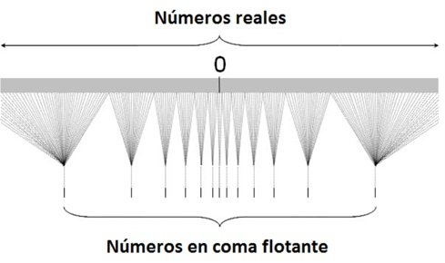

# Representación de la Información

## Índice
1. [Fundamentos de la Información Digital](#1-fundamentos-de-la-información-digital)
2. [Sistemas de Numeración](#2-sistemas-de-numeración)
3. [Representación de Números Enteros](#3-representación-de-números-enteros)
4. [Representación de Números Reales](#4-representación-de-números-reales)
5. [Representación de Caracteres](#5-representación-de-caracteres)

---

## 1. Fundamentos de la Información Digital

### Naturaleza de la Información Digital
Desde una perspectiva técnica, la **información** se define como todo aquello capaz de reducir la incertidumbre o aportar conocimiento.

{: style="display: block; margin: 0 auto" }
<center><em>Atributos y descriptores para la reducción de la incertidumbre</em></center>
<br>

En un sistema informático, esta información se materializa en forma de datos procesables.

En la arquitectura moderna de computadores (modelo **Von Neumann**), es fundamental comprender que la memoria principal almacena indistintamente dos categorías de entidades:

1.  **Instrucciones (Código):** La secuencia lógica de órdenes que dictan el comportamiento del procesador.
2.  **Datos:** La materia prima (números, caracteres, señales) sobre la que operan dichas instrucciones.

A bajo nivel, no existe diferencia física entre instrucciones y datos; ambos se representan universalmente mediante **patrones de bits** ($0$ y $1$), que en última instancia corresponden a estados físicos del hardware (niveles de voltaje, cargas eléctricas, magnetización...). Es el contexto de ejecución (cómo y cuándo accede el procesador a ellos) lo que determina su interpretación.

Esta naturaleza binaria se mantiene porque es la solución tecnológica más robusta: es más sencillo y seguro para un circuito distinguir entre dos estados extremos (On/Off) que intentar diferenciar 10 niveles de voltaje precisos, como requeriría una codificación adaptada al sistema decimal.

### Almacenamiento en el Ordenador: La Memoria
La memoria principal del ordenador se estructura como una **gran tabla lineal de celdas**. Cada celda es un espacio de almacenamiento direccionable individualmente.

En este esquema distinguimos dos conceptos clave:

1.  **Dirección (Address):** El número único que identifica la ubicación de la celda (como el número de un buzón).
2.  **Contenido:** El patrón de bits guardado en dicha celda.

#### Unidades de Medida
*   **Bit** (**Binary digit**): Unidad mínima de información ($0$ o $1$).
*   **Byte** (**Octeto**): Agrupación de **8 bits**. Es la **unidad mínima direccionable** de la memoria; el procesador lee o escribe bytes completos.


#### Visualización de la Memoria
Podemos imaginar la memoria como una tabla donde cada fila representa una celda con su propia **dirección**. En las arquitecturas actuales lo habitual es el **direccionamiento por Byte**, donde cada dirección de memoria apunta a 8 bits.

Dado que muchos datos requieren más capacidad, es común que un solo dato ocupe **varias celdas (direcciones) consecutivas**:


<div align="center">
<table style="margin: 0 auto;">
<thead>
<tr>
<th style="text-align:center">Dirección</th>
<th style="text-align:center">Contenido (Binario)</th>
<th style="text-align:left">Interpretación del Dato</th>
</tr>
</thead>
<tbody>
<tr>
<td style="text-align:center"><code>...</code></td>
<td style="text-align:center"><code>...</code></td>
<td style="text-align:left">...</td>
</tr>
<tr>
<td style="text-align:center"><code>1010</code></td>
<td style="text-align:center"><code>01000001</code></td>
<td style="text-align:left">Letra 'A' (1 Byte)</td>
</tr>
<tr>
<td style="text-align:center"><code>...</code></td>
<td style="text-align:center"><code>...</code></td>
<td style="text-align:left">...</td>
</tr>
<tr>
<td style="text-align:center"><code>2000</code></td>
<td style="text-align:center"><code>00000000</code></td>
<td rowspan="4" style="text-align:center; vertical-align:middle; background-color: #f8f8f8"><strong>Entero de 32 bits (4 Bytes)</strong><br>Valor: 484</td>
</tr>
<tr>
<td style="text-align:center"><code>2001</code></td>
<td style="text-align:center"><code>00000000</code></td>
</tr>
<tr>
<td style="text-align:center"><code>2002</code></td>
<td style="text-align:center"><code>00000001</code></td>
</tr>
<tr>
<td style="text-align:center"><code>2003</code></td>
<td style="text-align:center"><code>11100100</code></td>
</tr>
<tr>
<td style="text-align:center"><code>...</code></td>
<td style="text-align:center"><code>...</code></td>
<td style="text-align:left">...</td>
</tr>
<tr>
<td style="text-align:center"><code>3008</code></td>
<td style="text-align:center"><code>11100011</code></td>
<td rowspan="3" style="text-align:center; vertical-align:middle; background-color: #f0f0f0"><strong>Instrucción CPU (64 bits)</strong><br>8 Bytes</td>
</tr>
<tr>
<td style="text-align:center"><code>...</code></td>
<td style="text-align:center"><code>...</code></td>
</tr>
<tr>
<td style="text-align:center"><code>3015</code></td>
<td style="text-align:center"><code>10101100</code></td>
</tr>
<tr>
<td style="text-align:center"><code>...</code></td>
<td style="text-align:center"><code>...</code></td>
<td style="text-align:left">...</td>
</tr>
</tbody>
</table>
</div>


<p style="text-align: center;"><em>Modelo de la memoria como una tabla de celdas</em></p>


### Necesidad de la Codificación
Los humanos interactuamos con información simbólica (letras, números) o analógica (imágenes, sonido), mientras que el procesador trabaja internamente con estados binarios. Para salvar esta brecha es necesaria una transformación rigurosa:

$$ \text{Mundo Real} \xrightarrow{\text{Codificación}} \text{Mundo Digital} $$

En la vida real usamos habitualmente codificaciones: el NIA de un alumno de la UVa, el DNI, el código postal, etc.

Matemáticamente, la codificación debe ser una **transformación inyectiva**. En el caso informático esto significa que a cada elemento del conjunto original (ej. la letra 'A') le debe corresponder una secuencia de bits **única y exclusiva**. Si dos elementos distintos compartieran el mismo código, el proceso inverso (**decodificación**) sería ambiguo y no podríamos recuperar la información original sin errores.

#### Capacidad de Representación (Combinatoria)
Es un error común pensar que los bits suman capacidad linealmente. En realidad, la capacidad de diferenciar valores crece de forma **exponencial**: cada bit añadido **duplica** las posibilidades del anterior.

**Regla General:** Con $n$ bits podemos representar $m = 2^n$ valores diferentes.

<div class="center-table" markdown>

| Nº Bits | Cálculo ($2^n$) | Cantidad de Valores | Ejemplo de uso |
| :---: | :---: | :---: | :--- |
| **1** | $2^1$ | **2** | Bombilla (Encendida/Apagada) |
| **2** | $2^2$ | **4** | Los 4 palos de la baraja |
| **3** | $2^3$ | **8** | Rosa de los Vientos (N, S, E, O ,NO, NE, SO, etc.) |
| ... | ... | ... | ... |
| **8** | $2^8$ | **256** | **1 Byte** (Podemos representar caracteres) |
| **10** | $2^{10}$ | **1.024** | Aprox. 1000 ($1K$ en Binario) |
| **32** | $2^{32}$ | **~4.000 Millones** | Direcciones IP (Internet) |

</div>

<p style="text-align: center;"><em>Número de bits frente a capacidad de representación</em></p>

**Problema inverso:** Si necesito codificar $m$ valores, ¿cuál es el número mínimo $n$ de bits necesarios?

$$ n = \lceil \log_2 m \rceil \quad \longrightarrow \quad \text{Tomamos el entero más próximo por exceso} $$

!!! example "Ejemplo de cálculo de bits necesarios"
    Tenemos un almacén con **17524** contenedores y queremos identificarlos con una etiqueta binaria única.

    $$ \log_2 17524 \approx 14.097 $$
    
    **Solución:** Necesitamos **15 bits** (con 14 bits solo llegaríamos a 16.384 etiquetas).


## 2. Sistemas de Numeración

Antes de abordar cómo se almacenan en un sistema informático tipos de datos específicos (enteros, reales, texto), es imprescindible revisar la base matemática que lo sustenta. Aunque en la vida cotidiana operamos en **base** 10, el hardware impone el uso de bases potencias de 2.

El objetivo de este apartado no es convertirse en calculadoras humanas, sino entender la **lógica de traducción** entre el mundo humano y el de la máquina. Este conocimiento es vital para interpretar direcciones de memoria, entender los límites de capacidad de las variables o comprender cómo se representa internamente cualquier tipo de dato.

### Definición
Un sistema de numeración es una colección de símbolos y reglas para construir números válidos. Los sistemas usados en informática son **posicionales**: el valor de una cifra depende de su símbolo y de la posición que ocupa.

La **base ($b$)** es el número total de símbolos permitidos en el sistema. En un sistema posicional, la base también determina cuántas unidades de un orden inferior son necesarias para formar una unidad del orden inmediato superior (ej. 10 unidades forman 1 decena). Además, la base coincide con el valor por el cual se multiplican las posiciones sucesivas.

<div class="center-table" markdown>

| Sistema | Base ($b$) | Símbolos |
| :--- | :--- | :--- |
| **Decimal** | 10 | $\{0, 1, 2, 3, 4, 5, 6, 7, 8, 9\}$ |
| **Binario** | 2 | $\{0, 1\}$ |
| **Octal** | 8 ($2^3$) | $\{0, 1, 2, 3, 4, 5, 6, 7\}$ |
| **Hexadecimal** | 16 ($2^4$) | $\{0, ..., 9, A, B, C, D, E, F\}$ |

</div>

<p style="text-align: center;"><em>Bases habituales en Informática: A=10, B=11, ..., F=15</em></p>

### Valor Posicional (Polinomio Equivalente)
El concepto fundamental de los sistemas numéricos modernos es el **valor posicional**. A diferencia de los números romanos, aquí el valor de cada dígito no es absoluto, sino que depende de la posición que ocupe respecto a la coma (o punto) decimal.

Cada posición $i$ tiene un **peso** asignado que es una potencia de la base ($b^i$):

*   Hacia la **izquierda** (parte entera), los pesos son potencias no negativas: $b^0$ (unidades), $b^1$, $b^2$...
*   Hacia la **derecha** (parte fraccionaria), los pesos son potencias negativas: $b^{-1}$, $b^{-2}$...

Para traducir cualquier número a nuestro sistema decimal, simplemente sumamos cada dígito multiplicado por su peso. Esto se formaliza mediante el **polinomio equivalente**:

$$ N = \sum_{i=-k}^{n-1} d_i \cdot b^i $$

$$ N = d_{n-1}b^{n-1} + \dots + d_1 b^1 + d_0 b^0 + d_{-1} b^{-1} + \dots + d_{-k} b^{-k} $$

donde:

*   $d_i$: Es el dígito en la posición $i$.
*   $b$: Es la base del sistema (2, 8, 16...).
*   $i$: Es el índice de la posición ($i=0$ es la primera posición entera).


!!! example "Ejemplo: Hexadecimal a Decimal"
    Valor del número $3F.D_{16}$:

    $$ 3 \cdot 16^1 + 15 \cdot 16^0 + 13 \cdot 16^{-1} = 48 + 15 + 0.8125 = 63.8125_{10} $$

    *(Nota: F=15, D=13)*

### Conversión de Decimal a Base $b$

Para convertir un número de nuestro sistema decimal a cualquier otra base (binario, octal, hexadecimal...), debemos procesar por separado la parte entera y la fraccionaria, ya que responden a lógicas matemáticas inversas.

El método general consiste en dividir la parte entera y multiplicar la parte fraccionaria.

#### 1. Parte Entera: Divisiones Sucesivas
El algoritmo consiste en **dividir sucesivamente** el número decimal entre la base destino ($b$) hasta que el cociente sea 0.

*   En cada paso, el **resto** de la división se convierte en un dígito del número convertido.
*   **Importante:** El primer resto obtenido corresponde al bit menos significativo (LSD o posición $b^0$). Por tanto, el número final se construye leyendo los restos en **orden inverso** (del último obtenido al primero).

#### 2. Parte Fraccionaria: Multiplicaciones Sucesivas
Tomamos la parte decimal pura (0.xxxx) y la **multiplicamos** por la base destino ($b$).

*   La **parte entera** del resultado será el siguiente dígito fraccionario (empezando por $b^{-1}$).
*   El proceso se repite tomando solo la parte decimal restante del resultado anterior.
*   En este caso, los dígitos se leen en **orden directo** (en el orden en que aparecen).

!!! example "Ejemplo Completo: 35.625 a Binario"
    **Paso 1: Parte Entera (35)**

    *   $35 / 2 = 17$, Resto **1** (Este es el último bit, LSB)
    *   $17 / 2 = 8$, Resto **1**
    *   $8 / 2 = 4$, Resto **0**
    *   $4 / 2 = 2$, Resto **0**
    *   $2 / 2 = 1$, Resto **0**
    *   $1 / 2 = 0$, Resto **1** (Este es el primer bit, MSB)

    $\rightarrow$ Leemos de abajo hacia arriba: **$100011_2$**

    **Paso 2: Parte Fraccionaria (0.625)**

    *   $0.625 \times 2 = \mathbf{1}.25 \rightarrow$ Guardo el **1**, me quedo con $0.25$
    *   $0.25 \times 2 = \mathbf{0}.5 \rightarrow$ Guardo el **0**, me quedo con $0.5$
    *   $0.5 \times 2 = \mathbf{1}.0 \rightarrow$ Guardo el **1**, me queda $0.0$ (Fin)

    $\rightarrow$ Leemos de arriba hacia abajo: **$.101_2$**

    **Resultado Final:** $35.625_{10} = 100011.101_2$

#### Error de Truncamiento y Precisión Finita
En la parte fraccionaria, la conversión a menudo no es exacta, resultando en números periódicos infinitos (al igual que $1/3$ es $0.333...$ en decimal).
    

!!! example "Ejemplo con error de truncamiento"
    Por ejemplo, el simple valor $0.1_{10}$ en binario es una fracción periódica: $0.0001100110011...$
    
    Dado que el ordenador tiene un número finito de bits para guardar el número, está obligado a **cortar (truncar)** la secuencia en algún punto.

    **Cálculo del error con 4 bits fraccionarios:**
    Si solo guardamos los primeros 4 bits fraccionarios, almacenamos $0.0001_2$.
    
    *   Valor Real: $0.1$
    *   Valor Almacenado: $0.0001_2 = 1 \cdot 2^{-4} = 0.0625_{10}$
    *   **Error:** $|0.1 - 0.0625| = 0.0375$ (¡Un error del 37.5%!)

Esto implica que el ordenador casi nunca guarda *exactamente* el número real que escribimos, sino una aproximación muy cercana. El aumento del número de bits dedicado a almacenar la parte fraccionaria de un número palía el error, pero nunca desaparece en fracciones periódicas o valores irracionales.

### Uso de Hexadecimal y Octal

Aunque el ordenador trabaja estrictamente en binario, para los humanos leer secuencias largas como `101101011110` es lento, tedioso y muy propenso a errores visuales. 

Por esta razón, en informática se utilizan sistemas cuya base es una potencia exacta de 2 ($8=2^3$ y $16=2^4$). Estos sistemas funcionan como una **taquigrafía del binario**, permitiéndonos escribir la misma información de forma mucho más compacta sin tener que hacer divisiones o multiplicaciones complejas para la traducción.

*   **Hexadecimal (Base 16):** Es el estándar absoluto hoy en día. Se utiliza universalmente para representar **direcciones de memoria**, códigos de colores web (**#FFFFFF**), direcciones MAC o cualquier volcado de datos crudos (*raw data*). Un solo dígito hexadecimal representa **4 bits** (un *nibble*), por lo que dos dígitos hexadecimales representan exactamente **1 Byte**.
*   **Octal (Base 8):** Agrupa los bits de **3 en 3**. Fue muy popular en las primeras décadas de la informática (para palabras de 12, 24 o 36 bits), pero hoy su uso ha quedado relegado casi exclusivamente a la gestión de **permisos de ficheros en sistemas UNIX/Linux** (ej. `chmod 755`).

#### Método de Conversión por Agrupación
La conversión es directa y visual, ya que cada dígito en estas bases corresponde a un bloque fijo de bits.

1.  **Binario $\to$ Hexadecimal:** Agrupamos los bits de **4 en 4** partiendo desde la coma decimal hacia los extremos (izquierda para enteros, derecha para fracción). Si el último grupo queda incompleto, se rellena con ceros.
2.  **Binario $\to$ Octal:** El mismo proceso, pero haciendo grupos de **3 bits**.

!!! example "Ejemplo Completo con Decimales y Relleno"
    Convertir a Hexadecimal el binario: `111010.11011`
    
    El proceso exige agrupar de 4 en 4 **desde la coma hacia afuera**.
    
    **1. Parte Entera (`111010`):**
    *   Desde la coma a la izquierda: `1010` (grupo completo) $\to$ Quedan `11` sueltos.
    *   Rellenamos con ceros a la **izquierda**: `0011`.
    *   Grupos resultantes: `0011` | `1010` $\to$ **3** | **A**
    
    **2. Parte Fraccionaria (`.11011`):**
    *   Desde la coma a la derecha: `1101` (grupo completo) $\to$ Queda `1` suelto.
    *   Rellenamos con ceros a la **derecha**: `1000`.
    *   Grupos resultantes: `1101` | `1000` $\to$ **D** | **8**

    Resultado: **$3A.D8_{16}$**
    
    *(Nota: Los ceros de relleno son cruciales. Si en la parte fraccionaria hubiéramos tomado `1` como `0001` (1) en vez de `1000` (8), el error sería enorme)*

Convertir directamente de Octal a Hexadecimal o viceversa es simple si se usa como estrategia el **Binario como puente**:

$$ \text{Octal} \xrightarrow{\text{expandir a 3 bits}} \text{Binario} \xrightarrow{\text{agrupar de 4 bits}} \text{Hexadecimal} $$

$$ \text{Hexadecimal} \xrightarrow{\text{expandir a 4 bits}} \text{Binario} \xrightarrow{\text{agrupar de 3 bits}} \text{Octal} $$


## 3. Representación de Números Enteros

Los números enteros son la piedra angular de la aritmética computacional. No solo representan cantidades matemáticas, sino que constituyen el *lenguaje interno* del procesador: las direcciones de memoria, los punteros, los índices de arrays y los contadores de bucles son, estructuralmente, números enteros.

A diferencia de los números reales, la aritmética entera es **exacta**; no sufre de errores de precisión por redondeo. Sin embargo, se enfrenta a una limitación física ineludible: el **rango finito**. Al tener un número fijo de bits (ancho de palabra), existe un límite máximo y mínimo estricto que podemos representar, y superar ese límite tiene consecuencias drásticas.

### Enteros Sin Signo (Binario Puro)
Este formato se emplea para modelar problemas reales donde las magnitudes son siempre no negativas (el conjunto de los Naturales $\mathbb{N}$ más el cero).

**Usos típicos:**

*   Contadores de elementos (ej. número de alumnos).
*   Índices para acceder a listas o vectores.
*   Direcciones de memoria.

La representación interna coincide exactamente con el sistema numérico posicional base 2 visto anteriormente. Al no necesitar guardar información sobre el **signo**, utilizamos los $n$ bits completos para la magnitud.

*   **Rango Representable:** $[0, \quad 2^n - 1]$


<div class="center-table" markdown>

| Decimal | Patrón Binario ($b_7 \dots b_0$) | Lógica |
| :---: | :---: | :--- |
| **0** | `00000000` | Todos apagados |
| **1** | `00000001` | $2^0$ |
| **2** | `00000010` | $2^1$ |
| **3** | `00000011` | $2^1 + 2^0$ |
| ... | ... | ... |
| **254** | `11111110` | $2^7 + 2^6 + ... + 2^0$ |
| **255** | `11111111` | **Máximo** ($2^8 - 1$) |

</div>

<p style="text-align: center;" markdown="1"><em>Tabla de Valores para $n=8$ bits</em></p>

#### Desbordamiento
Si a 255 (`11111111`) le sumamos 1, el resultado matemático sería 256 (`100000000`), pero como solo tenemos 8 bits, el bit superior se pierde y el resultado almacenado vuelve a ser **0** (`00000000`). Esto es el **desbordamiento** (*overflow*).

### Enteros Con Signo

#### 1. Signo y Magnitud
Es la forma más intuitiva para los humanos de representar números negativos. Consiste en utilizar el **bit más significativo (MSB)** exclusivamente para codificar el signo:

*   **Bit de Signo:** `0` para positivos, `1` para negativos.
*   **Magnitud:** Los $n-1$ bits restantes codifican el valor absoluto del número en binario puro.

**Rango de Representación:** $[-(2^{n-1} - 1), \quad +(2^{n-1} - 1)]$

!!! example "Representar en *Signo y Magnitud* -47 con 8 bits"
    Queremos codificar el número decimal **$-47_{10}$**.
    
    1.  **Bit de Signo:** Como es negativo, el bit más a la izquierda (MSB) es **`1`**.
    2.  **Magnitud (7 bits restantes):**
        *   Calculamos el valor absoluto: $|-47| = 47$.
        *   Descomponemos en potencias de 2: $47 = 32 + 8 + 4 + 2 + 1$.
        *   En binario puro es `101111` (6 bits).
        *   Rellenamos con ceros a la izquierda hasta completar los 7 bits reservados para la magnitud: **`0101111`**.
    
    **Resultado Final:** `1` (Signo) + `0101111` (Magnitud) = **`10101111`**

**Problemas y Desuso:**
Aunque conceptualmente sencilla, esta representación tiene graves defectos para el diseño de hardware:

1.  **Doble Cero:** Existen el $+0$ (`00000000`) y el $-0$ (`10000000`). Esto complica las comparaciones (`if x == 0`).
2.  **Aritmética Compleja:** La CPU necesitaría evaluar los signos antes de operar (como hacemos los humanos: *"si los signos son distintos, restamos"*). Esto es ineficiente; se prefiere un sistema donde la electrónica asociada a la suma funcione igual para positivos y negativos.

#### 2. Complemento a 2 (C2)
Es el sistema estándar utilizado por la aritmética de enteros en casi todos los procesadores modernos y el formato detrás del tipo entero en muchos de los lenguajes de programación.

**Definición Matemática:**
El complemento a la base $b$ de un número positivo $X$ codificado con $n$ cifras se define como $b^n - X$. En binario ($b=2$), esto es lo que llamamos Complemento a 2.

**Reglas de Representación:**

*   **Positivos y el 0:** Se representan idéntico a Signo-Magnitud (el MSB es `0`).
*   **Negativos:** Se representan calculando el complemento a 2 de su valor absoluto (el MSB es `1`).

**Interpretación del Peso Negativo (Polinomio Equivalente):**
Lo más interesante del C2 es que el bit de signo (MSB, posición $n-1$) no es solo una etiqueta, sino que tiene **valor matemático**. Su peso es igual a la potencia correspondiente pero con **signo negativo**.

$$ N = -d_{n-1} \cdot 2^{n-1} + \sum_{i=0}^{n-2} d_i \cdot 2^i $$

$$ N = \mathbf{-d_{n-1}2^{n-1}} + d_{n-2}2^{n-2} + \dots + d_1 2^1 + d_0 2^0 $$

*   **Rango:** $[-2^{n-1}, \quad 2^{n-1} - 1]$. (Es asimétrico: hay un valor negativo extra porque el 0 "gasta" una combinación de los positivos).


!!! example "Ejemplo: Obtener el número negativo $-13$ en C2 con 6 bits"
    
    Escribir el positivo: $13_{10} = 001101_2$ (Rellenamos con ceros hasta 6 bits)
    
    **Método 1: Inversión + 1 (Estándar)**

    *   Invertir todos los bits (cambiar 0s por 1s): `110010`
    *   Sumar 1 al resultado final: `110010` + `1` = **`110011`**
    
    **Método 2: Regla rápida (Visual)**

    *   Recorrer de derecha a izquierda hasta el primer '1' (inclusive), dejar esos bits igual e invertir el resto.
    *   `00110`**`1`** $\to$ Invertir parte izquierda $\to$ **`11001`**`1`

    **Método 3: Definición Matemática ($2^n - X$)**

    *   Aplicamos la fórmula estricta con $n=6$ y $X=13$.
    *   $2^6 - 13 = 64 - 13 = 51$
    *   Convertimos 51 a binario puro $\to$ **`110011`**

!!! example "Ejemplo: Obtener el número negativo $-13$ en C2 con 10 bits"
    
    Escribir el positivo: $13_{10} = 0000001101_2$ (Rellenamos con ceros hasta 10 bits)
    
    **Método 1: Inversión + 1 (Estándar)**

    *   Invertir todos los bits: `1111110010`
    *   Sumar 1: `1111110010` + `1` = **`1111110011`**
    
    **Método 2: Regla rápida (Visual)**

    *   `000000110`**`1`** $\to$ Invertir parte izquierda $\to$ **`111111001`**`1`

    **Método 3: Definición Matemática**

    *   $2^{10} - 13 = 1024 - 13 = 1011$
    *   $1011_{10}$ en binario es **`1111110011`**
    
    Resultado: **$1111110011_{C2}$**

!!! info "Curiosidad Histórica: El Complemento a 1"
    Existe otra representación llamada **Complemento a la base menos 1** (Complemento a 1 en binario), que se obtiene simplemente intercambiando 0s y 1s.
    
    Esta técnica fue utilizada en algunas series de computadoras pioneras descendientes de la **ENIAC**, como la serie **UNIVAC**. Actualmente está en desuso frente al Complemento a 2 porque, al igual que el Signo-Magnitud, sufre del problema del *doble cero*.

!!! tip "La Analogía del Reloj"
    El Complemento a 2 funciona exactamente igual que los minutos en un reloj analógico (aritmética modular).
    
    Si el reloj marca las `:00` y queremos restar 10 minutos:
    
    *   **Opción A (Resta):** Mover la aguja 10 minutos hacia atrás $\to$ Posición `:50`.
    *   **Opción B (Suma del Complemento):** Mover la aguja 50 minutos hacia adelante $\to$ Posición `:50`.
    
    En un sistema cíclico (limitado), **avanzar 50** pasos te deja en el mismo sitio que **retroceder 10**.
    
    El ordenador usa este truco para **no tener que implementar la resta** en hardware (que es costosa).
    Por ejemplo, en un sistema de 8 bits (donde la vuelta completa son 256 pasos), restar 1 es equivalente a sumar 255.
    
    Si calculamos $5 + 255$, la suma aritmética es $260$. Pero como solo tenemos 8 bits, se produce un **desbordamiento** (se pierde el bit que sobra al dar la vuelta) y el contador se queda en $4$.
    $$ 5 + 255 \equiv 4 \pmod{256} $$
    ¡Hemos conseguido el resultado correcto ($5-1=4$) usando solo la suma!

### La suma Binaria

Aunque las CPUs modernas son capaces de realizar operaciones aritméticas complejas (multiplicación, división...), la base fundamental del diseño hardware es la **suma**. De hecho, operaciones como la multiplicación se implementan a menudo mediante secuencias rápidas de sumas y desplazamientos (*shifts*). Por este motivo, nos centraremos en analizar en detalle el circuito sumador como bloque constructivo esencial de la ALU.

La genialidad del uso del **Complemento a 2** radica en que elimina la distinción entre suma y resta. Matemáticamente y eléctricamente, **restar es simplemente sumar un número negativo**:
$$ A - B \iff A + (-B) $$
Esta propiedad permite que un único circuito físico resuelva ambas operaciones, simplificando drásticamente el diseño del procesador.

#### Reglas básicas
Las reglas básicas para sumar 2 bits son:

* $0+0=0$
* $0+1=1$       
* $1+0=1$        
* $1+1=10$

Al igual que ocurre en la aritmética decimal (ej. $7+8=15$), se produce **acarreo** en el caso $1+1=10$.
La suma aislada de dos bits, conocida como **semisumador binario**, podemos describirla con una **tabla de verdad** con dos bits de entrada, $p$ y $q$, y dos bits de salida, suma $S$ y acarreo $C$.

<div class="center-table" markdown>

| $p$ | $q$ | $C$ (Acarreo) | $S$ (Suma) |
| :---: | :---: | :---: | :---: |
| 0 | 0 | 0 | 0 |
| 0 | 1 | 0 | 1 |
| 1 | 0 | 0 | 1 |
| 1 | 1 | 1 | 0 |

</div>

<p style="text-align: center;"><em>Tabla de Verdad del semisumador binario</em></p>

{: style="display: block; margin: 0 auto" }
<center><em>Semisumador binario</em></center>
<br>

El problema del semisumador es que no puede gestionar el acarreo procedente de una suma anterior. Si queremos sumar números de varios bits (como hacemos en papel), necesitamos un circuito que sume **tres** cosas: el bit del primer número, el bit del segundo, y el **acarreo de entrada** ($C_{e}$) que arrastramos de la posición previa.

!!! example "Propagación del acarreo"
    Supongamos que queremos sumar $6_{10} + 7_{10}$ en binario ($00110 + 00111$).
    Al igual que ocurre en la aritmética decimal (ej. $87+78$), se generan acarreos que deben sumarse en la siguiente posición:

    ```text
        1 1        <-- Acarreos
      0 0 1 1 0      (6)
    + 0 0 1 1 1      (7)
    -----------
      0 1 1 0 1      (13)
    ```

Por esta razón necesitamos el **Sumador Completo**, que es capaz de procesar ese tercer bit de entrada.


El sumador completo binario podemos describirlo con una tabla de verdad con tres bits de entrada, $p$, $q$ y $C_e$ y dos bits de salida $S$ y $C_s$. $C_e$ es el valor de acarreo procedente de la suma de los bits anteriores y $C_s$ es el acarreo que se inyecta a la siguiente suma de bits.

<div class="center-table" markdown>

| $p$ | $q$ | $C_e$ (Entrada) | $C_s$ (Salida) | $S$ (Suma) |
| :---: | :---: | :---: | :---: | :---: |
| 0 | 0 | 0 | 0 | 0 |
| 0 | 0 | 1 | 0 | 1 |
| 0 | 1 | 0 | 0 | 1 |
| 0 | 1 | 1 | 1 | 0 |
| 1 | 0 | 0 | 0 | 1 |
| 1 | 0 | 1 | 1 | 0 |
| 1 | 1 | 0 | 1 | 0 |
| 1 | 1 | 1 | 1 | 1 |

</div>

<p style="text-align: center;"><em>Tabla de Verdad del sumador binario completo</em></p>

<br>

{: style="display: block; margin: 0 auto" }
<center><em>Sumador completo binario</em></center>
<br>

Supongamos que necesitamos sumar dos números binarios $x_3x_2x_1x_0$ e $y_3y_2y_1y_0$ de 4 bits. Bastaría disponer de 4 sumadores completos colocados en serie para realizar la operación en paralelo.

{: style="display: block; margin: 0 auto" }
<center><em>Sumadores en serie</em></center>
<br>

Combinando sumadores completos podemos sumar números con el número de bits deseado. 


### Justificación del uso de C2 en la CPU

Veamos la razón fundamental por la que los ordenadores utilizan Complemento a 2 analizando la operación $6 + (-7)$ (cuyo resultado debe ser $-1$) con un sumador binario estándar de 4 bits.

**1. Usando Signo-Magnitud:**
En Signo-Magnitud, el bit más significativo es el signo.
* $6_{10} \rightarrow 0110_{SM}$
* $-7_{10} \rightarrow 1111_{SM}$

Si sumamos estos patrones de bits directamente:

```text
   1 1 1          <-- Acarreos
     0 1 1 0      (6)
  +  1 1 1 1      (-7)
  ----------
   1 0 1 0 1      (+5) --> ¡ERROR! ¡El último bit de acarreo se pierde!
```

El resultado obtenido $0101_{SM}$ corresponde a $+5_{10}$.
**¡El resultado es ERRÓNEO!** Un sumador estándar no funciona para números mixtos en Signo-Magnitud.

**2. Usando Complemento a 2 (C2):**
* $6_{10} \rightarrow 0110_{C2}$
* $-7_{10} \rightarrow 1001_{C2}$ ( Invertir $0111 \rightarrow 1000$; Sumar $1 \rightarrow 1001$)

Operando con el mismo circuito sumador:

```text
                 <-- Acarreos
    0 1 1 0      (6)
  + 1 0 0 1      (-7)
  ---------
    1 1 1 1      (-1) --> ¡CORRECTO!
```

El resultado $1111_{C2}$ corresponde al valor $-1_{10}$ (pues $-8 + 4 + 2 + 1 = -1$).
**¡El resultado es CORRECTO!**

!!! success "Eficiencia del C2"
    Esta propiedad es la justificación real del uso universal del Complemento a 2 en las CPUs modernas: permite utilizar **el mismo circuito sumador** para operaciones con y sin signo, simplificando enormemente el diseño del hardware (ALU).

!!! note "Desbordamiento (Overflow) vs Acarreo"
    Es crucial diferenciar entre el **acarreo** (carry out), que es normal y se ignora en aritmética con signo, y el **desbordamiento** (overflow), que es un error crítico.

    **Regla de Detección:** El desbordamiento ocurre cuando se suman dos números del **mismo signo** y el resultado tiene el **signo opuesto**. Nunca ocurre si los signos son distintos.

    Imaginemos un sistema de **4 bits** (Rango: $[-8, +7]$).

    **1. Acarreo NO Problemático (Se ignora):**
    Sumamos $(-3) + (-2) = -5$. (Dentro de rango).
    
    ```text
      1 1       <-- Acarreos
        1 1 0 1  (-3)
      + 1 1 1 0  (-2)
      ---------
      1 1 0 1 1  --> Nos quedamos con 4 bits: 1011 (-5) ¡CORRECTO!
    ```
    El bit sobrante (5º bit) se descarta y el resultado es matemáticamente correcto.

    **2. Desbordamiento Problemático (Error):**
    Sumamos $5 + 4 = 9$. (Fuera de rango, máximo es 7).
    
    ```text
        1        <-- Acarreo entra en bit signo pero NO sale
        0 1 0 1  (5)
      + 0 1 0 0  (4)
      ---------
        1 0 0 1  (-7) ¡ERROR GRAVE!
    ```
    Dos números positivos han generado un negativo. **Esto es Overflow.**

    **¿Quién detecta el error?**
    *   **Hardware (ALU):** **SIEMPRE** detecta el desbordamiento (activa un *flag* de estado interno).
    *   **Software (C++):** Por defecto **IGNORA** esta señal para ganar velocidad. El programa continúa ejecutándose con el valor erróneo sin avisar (comportamiento indefinido o *wrap-around*).


### Representación de Enteros en Lenguajes de Programación


La representación interna de los números enteros depende drásticamente del lenguaje. Mientras que C++ ofrece control sobre el hardware (tamaños fijos), Python ofrece abstracción matemática (tamaños dinámicos).

#### C++
**Filosofía:** Eficiencia y cercanía al Hardware.

*   **Tamaños fijos:** C++ permite trabajar con enteros de 8, 16, 32 o 64 bits.
*   **Tipos:** Soporta `signed` (Complemento a 2) y `unsigned` (Binario Puro).

Este diseño obedece al concepto de **POD (Plain Old Data)**: los tipos básicos de C++ son datos *crudos*, secuencias de bits en memoria sin metadatos ni cabeceras ocultas. Un `int` de 32 bits ocupa exactamente 32 bits en RAM, nada más.

**Ejemplo: Representación en Memoria (32 bits)**
```cpp
int x = 23;  // Memoria: 00000000 ... 00010111
int x = -23; // Memoria: 11111111 ... 11101001 (Complemento a 2)
```

**Enteros sin Signo (`unsigned`)**
Eliminan el bit de signo para duplicar el rango positivo ($[0, 2^{32}-1]$ en 32 bits).

!!! warning "Riesgo de Desbordamiento"
    Haciendo honor a su filosofía de eficiencia, C++ **ignora el flag de overflow** de la ALU y no realiza comprobaciones adicionales.
    
    Si se supera el rango máximo, la variable simplemente *da la vuelta* (wrap-around) y continúa con un valor incorrecto sin avisar. **¡El programa no se detiene ni genera una excepción!**

    Por ejemplo, si sumamos 1 al máximo valor entero con signo de 32 bits ($2.147.483.647$), obtendremos el mínimo negativo ($-2.147.483.648$). 

#### Python
**Filosofía:** Comodidad y Abstracción.

*   **Precisión Arbitraria:** En Python 3, los enteros (`int`) crecen dinámicamente tanto como la RAM permita. ¡No existe *overflow* aritmético!
*   **Sin tipos `unsigned`:** Todos los enteros tienen signo.

**Estructura Interna (Precisión Arbitraria o *BigNum*)**
A diferencia de C++, donde un entero es una caja de tamaño fijo (si metes algo más grande, se rompe), en Python un entero es como un *acordeón* que se estira según se necesite.

Para lograr esto, Python no guarda el número tal cual lo hace el procesador. En su lugar, trocea el número grande en pequeños bloques de 30 bits y los trata como si fueran *dígitos* de una base numérica gigante (**Base $2^{30}$**).

Matemáticamente, funciona igual que nuestro sistema decimal (donde sumamos unidades, decenas, centenas...), pero usando potencias de $2^{30}$:
$$N = \sum_{i=0} d_i \cdot (2^{30})^i = d_0 + d_1 \cdot 2^{30} + d_2 \cdot 2^{60} + \dots$$

!!! example "Ejemplo Práctico"
    Imagina un número enorme como `123456789101112131415` (requiere unos 70 bits).
    1.  Como no cabe en un registro de CPU de 64 bits, Python lo descompone.
    2.  Calcula sus *dígitos* en base $2^{30}$ y obtiene tres bloques: `437976919`, `87719511` y `107`.
    3.  Guarda internamente una lista con la **magnitud**: `[437976919, 87719511, 107]`.
    
    Utiliza un campo extra para indicar la longitud y el signo: almacenará **3** si es positivo o **-3** si es negativo. Este valor se almacena en **Complemento a 2**. El signo de este campo es el signo del número original y su valor absoluto determina cuantos bloques (dígitos) tiene la lista.

    Si multiplicas este número por 1000 y el resultado necesita más espacio, Python simplemente añade un cuarto dígito a la lista.

!!! note "El precio de la magia"
    Mientras que en C++ sumar dos números es **una sola instrucción** eléctrica (nanosegundos), en Python implica ejecutar un pequeño programa que recorre estas listas, gestiona los acarreos y asigna memoria. Es mucho más cómodo, pero mucho más lento.


## 4. Representación de Números Reales

Un número real consta de una parte entera y otra fraccionaria, más el signo.
Existen dos opciones de representación: **coma fija** o **coma flotante**.

### La Coma Fija (Fixed Point)

Se asigna una cantidad fija de dígitos para la parte entera y una cantidad fija para la parte fraccionaria.

Obviando por el momento el signo, si disponemos de 8 bits y reservamos 5 bits para la parte entera y 3 para la fraccionaria, el número $21.75_{10}$ ($10101_2$ entero y $0.11_2$ fraccionario) se almacenaría como **`10101110`**.

Al usar la notación en coma fija, queda muy limitado el rango de cantidades a representar, aunque todas ellas tienen la misma resolución (distancia entre valores).

**Ejemplo: 8 bits (5 bits parte entera y 3 bits parte fraccionaria)**. Sin tener en cuenta el signo:

*   No podremos representar números enteros mayores o iguales que $32$ ($2^5$).
*   Ni números más pequeños que $0.125$ ($2^{-3}$).
*   La resolución fija entre dos valores consecutivos es $0.125$ ($2^{-3}$).

!!! tip "Uso actual e Implementación Real: Enteros Escalados"
    Aunque simple, las limitaciones conceptuales de rango hacen que la coma fija rara vez se use para cálculos científicos generales. Sin embargo, sigue siendo el estándar en dos áreas críticas:

    1.  **Sistemas Financieros:** La coma flotante comete errores minúsculos de redondeo (ej. `0.1 + 0.2` a menudo da `0.30000000000000004`). En banca, un céntimo perdido es inaceptable.
    2.  **Microcontroladores y DSP:** Muchos procesadores pequeños (como los de una lavadora o un juguete) no tienen circuitería compleja para decimales (FPU) por ser cara y lenta.

    **¿El secreto? Trabajar solo con ENTEROS (Scaled Integers)**.
    En la práctica, estas máquinas no *saben* que existen decimales. El programador **decide de antemano** (en tiempo de diseño) cuántos bits dedicará a la parte fraccionaria y mantiene esa decisión fija para todas las operaciones. Simplemente escala los valores:

    *   *Objetivo:* Guardar $19.95$.
    *   *Factor de escala:* $\times 100$ (para tener 2 decimales de precisión).
    *   *Microcontrolador:* Calcula $1995$ y lo guarda en un entero normal (`int`).
    
    Si luego quiere sumar $5.00$, el micro suma $500$.
    $$ 1995 + 500 = 2495 $$
    Finalmente, para mostrarlo al usuario, el programador escribe el código para *pintar* una coma dos posiciones a la izquierda: $24.95$. ¡El procesador solo sumó enteros!

### La Coma Flotante (Floating Point)
Esta es la solución adoptada universalmente en la informática moderna para uso general. Permite cubrir un rango de valores gigantesco sacrificando precisión absoluta en los decimales menos significativos. El nombre proviene de que la coma *flota* (se mueve), permitiendo representar con la misma cantidad de bits números muy grandes (con poca precisión decimal) o números muy pequeños (con mucha precisión).

!!! failure "Contexto Histórico: El Caos Previo a 1985"
    Hasta finales del siglo XX (concretamente antes de 1985), **no existía un estándar unificado**. Cada fabricante de hardware (IBM, DEC, Cray, VAX...) diseñaba su propio formato de coma flotante, con sus propias reglas de redondeo y tamaños de exponente.
    
    Esto provocaba graves problemas de **portabilidad**: un mismo programa científico en C o Fortran podía arrojar resultados numéricos distintos dependiendo de si se ejecutaba en un mainframe IBM o en un ordenador personal. Esta *Torre de Babel* numérica impedía el intercambio fiable de datos y obligó a la industria a consensuar una norma común.
#### Fundamentos: Notación Científica
Antes de entrar en el estándar, recordemos que un número real $r$ en coma flotante se representa conceptualmente usando **notación científica**:

$$ r = \pm m \cdot b^e $$

donde:

*   $m$ es el **significando** o **mantisa**: un coeficiente formado por un número real con **una sola cifra entera** (distinta de cero) seguida por una coma y varias cifras fraccionarias.
*   $b$ es la **base** del sistema de numeración ($10$ en decimal, $2$ en binario).
*   $e$ es el **exponente** entero al que se eleva la base.

!!! example "Comparativa: Base 10 vs Base 2"
    **En Decimal (Base 10):**
    Supongamos el número $-0.00345$.
    *   Normalizado: $-3.45 \times 10^{-3}$
    *   Mantisa: $3.45$
    *   Exponente: $-3$

    **En Binario (Base 2):**
    Supongamos el número $0.001101_2$ ($0.203125_{10}$).
    *   Desplazamos la coma hasta dejar un solo '1' a la izquierda: $1.101 \times 2^{-3}$.
    *   Mantisa: $1.101$ (Nota: En binario, la única cifra entera posible no nula es **1**).
    *   Exponente: $-3$.

El estándar IEEE 754 simplemente define cómo empaquetar estos tres valores (signo, exponente y mantisa) dentro de una palabra de 32 o 64 bits.
#### Estándar IEEE 754
Prácticamente todos los computadores modernos siguen este estándar. Se basa en adaptar la **notación científica** al mundo binario:

$$ V = (-1)^s \cdot (1 + m) \cdot 2^{e - Bias} $$

*   **$s$ (Signo):** 1 bit ($0 \to +$, $1 \to -$).
*   **$m$ (Mantisa):** Parte fraccionaria normalizada ($1.xxxxx...$).
*   **$e$ (Exponente):** Entero representado en **exceso** (Bias).

<div class="center-table" markdown>

| Precisión | Bits Totales | Signo | Exponente ($k$) | Mantisa ($p$) | Exceso (Bias) | Cifras Decimales |
| :--- | :---: | :---: | :---: | :---: | :---: | :---: |
| **Simple (`float`)** | 32 | 1 | 8 | 23 | 127 | ~7 |
| **Doble (`double`)** | 64 | 1 | 11 | 52 | 1023 | ~16 |

</div>

<p style="text-align: center;"><em>Estructura del estándar IEEE 754</em></p>

### Características Clave
1.  **Exponente en Exceso:** Se almacena sumando un sesgo ($Bias$) al exponente real.
    *   **Cálculo del Bias:** Depende del número de bits del exponente ($k$):
        $$ Bias = 2^{k-1} - 1 $$
        *   *Simple precisión* ($k=8$): $2^{7} - 1 = 128 - 1 = 127$.
        *   *Doble precisión* ($k=11$): $2^{10} - 1 = 1024 - 1 = 1023$.
    *   $E_{guardado} = E_{real} + Bias$.
    *   Permite comparar los exponentes como enteros sin signo, facilitando la ordenación rápida de números.
2.  **Bit Implícito:** En la notación normalizada binaria, el número siempre empieza por `1.` (ej. `1.011...`). Para ahorrar espacio, ese `1` **no se guarda**, se asume implícitamente.

#### Orden de Almacenamiento y Comparación
El orden físico de los bits en la memoria es estricto: primero el **Signo**, seguido del **Exponente**, seguido de la **Mantisa**.

`[Signo]` | `[Exponente]` | `[Mantisa]`

El orden no es baladí: permite que los **algoritmos de comparación** (y por tanto los chips que los implementan) diseñados para números enteros sean también válidos (en su mayoría) para esta representación de números reales.

!!! info "Terminología Técnica"
    En alguna bibliografía clásica se utiliza la palabra **característica** para distinguir el *valor almacenado* (con el sesgo sumado) del *exponente real* matemático.

Al colocar el exponente en los bits más significativos (a la izquierda de la mantisa), logramos que un número con mayor orden de magnitud parezca *visual y numéricamente* mayor que uno con menor orden de magnitud, independientemente de sus decimales.

Pero para que este truco funcione, es **crítico que el exponente use representación en EXCESO** (que siempre es positivo) y **NO en Complemento a 2**.

**Ejemplo Simplificado: La importancia del Exceso vs C2**
Comparemos un número grande positivo (Exponente $+1$) con un número pequeño (Exponente $-1$).
*   $A$: $1.0 \times 2^{+1}$ (Grande)
*   $B$: $1.0 \times 2^{-1}$ (Pequeño)

**Caso 1: Usando Exponente en Complemento a 2 (Falso)**
*   $+1$ en C2 (3 bits) $\to$ `001`
*   $-1$ en C2 (3 bits) $\to$ `111`
*   Al comparar los bits como enteros sin signo: `111` ($7$) > `001` ($1$).
*   **Resultado:** ¡El hardware pensaría erróneamente que el número pequeño ($B$) es mayor que el grande ($A$)!

**Caso 2: Usando Exponente en Exceso (Real - IEEE 754)**
Supongamos un Bias de 3 ($2^{3-1}-1$).
*   Exponente real $+1$ $\to$ Guardado: $1 + 3 = 4$ (`100`)
*   Exponente real $-1$ $\to$ Guardado: $-1 + 3 = 2$ (`010`)
*   Comparación de bits: `100` ($4$) > `010` ($2$).
*   **Resultado:** `A > B`. **CORRECTO**.

!!! success "Diseño Inteligente"
    Gracias al uso del **Exceso**, los exponentes negativos se representan con códigos binarios *pequeños* (ej. 00...) y los positivos con códigos *grandes* (ej. 11...), preservando el orden natural de los números enteros. Esto permite usar comparadores rápidos de enteros en la ALU.

!!! example "Ejemplo: Convertir 13.125 a IEEE 754 (Simple)"
    1.  **Binario:** $13.125_{10} = 1101.001_2$
    2.  **Normalizar:** $1.101001 \times 2^3$
    3.  **Componentes:**
        *   Signo: $0$ (+)
        *   Exponente Real: $3$. Exponente guardado: $3 + 127 = 130 \to 10000010_2$.
        *   Mantisa: $101001...$ (rellenar con ceros a la derecha hasta 23 bits).
    4.  **Resultado Hex:** 
        *   Binario: `0 10000010 1010010000...`
        *   Agrupando: `0100 0001 0101 0010 0000...` $\to$ `4 1 5 2 0 ...` 
        *   Hexadecimal: **`0x41520000`**

!!! example "Ejemplo Inverso: Decodificar 0xC1480000 a Decimal"
    1.  **Binario:** `0xC1480000` $\to$ `1100 0001 0100 1000 0000...`
    2.  **Separar campos:**
        *   **Signo (1 bit):** `1` $\to$ Negativo ($-$).
        *   **Exponente (8 bits):** `10000010` $\to$ $130_{10}$.
        *   **Mantisa (23 bits):** `1001000...`
    3.  **Cálculos:**
        *   **Exponente Real:** $E = 130 - 127 (\text{Bias}) = 3$.
        *   **Mantisa con implícito:** $1.1001000...$
    4.  **Valor:**
        *   $(-1) \times 1.1001_2 \times 2^3$
        *   Desplazar la coma 3 sitios a la derecha: $-1100.1_2$
        *   Convertir a decimal: $-(8 + 4 + 0.5) = $ **$-12.5$**

#### Casos Especiales
El estándar reserva los valores de exponente mínimo (todos 0s) y máximo (todos 1s) para casos excepcionales. Permite representar el **Cero** (que mantiene signo), indicar desbordamientos mediante **Infinito** ($\pm \infty$) y señalar errores matemáticos (como divisiones imposibles o raíces de negativos) con el valor **NaN** (*Not a Number*).

<div class="center-table" markdown>

| Exponente | Mantisa | Significado |
| :--- | :--- | :--- |
| Todos 0 | Todos 0 | Cero ($\pm 0$) |
| Todos 0 | $\neq 0$ | Números desnormalizados (muy pequeños) |
| Todos 1 | Todos 0 | Infinito ($\pm \infty$) |
| Todos 1 | $\neq 0$ | NaN (Not a Number) |

</div>

<p style="text-align: center;"><em>Casos especiales de la norma IEEE 754</em></p>

!!! example "¿Qué operación provoca qué?"
    Es común confundir qué genera un Infinito y qué genera un NaN. La ALU sigue reglas matemáticas de límites:
    
    *   **Infinito ($\pm \infty$):** Aparece cuando el resultado *crece* sin límite o supera la capacidad de almacenamiento.
        *   $8.0 / 0.0 \to +\infty$ (Cualquier número distinto de cero dividido entre cero).
        *   $10^{308} \times 10 \to +\infty$ (Desbordamiento hacia arriba).
    *   **NaN (No es un Número):** Aparece ante **indeterminaciones** matemáticas donde no existe una respuesta lógica única.
        *   $0.0 / 0.0 \to \text{NaN}$ (Indeterminación)
        *   $\infty - \infty \to \text{NaN}$ (Indeterminación)
        *   $\sqrt{-5} \to \text{NaN}$ (Imposible en reales)

    La colocación de los patrones de bits la realiza el **hardware** (la Unidad de Coma Flotante o FPU) en tiempo real mediante circuitos que monitorizan las excepciones *antes* o *durante* la operación. Por ejemplo, para $\sqrt{-5}$ se activa la excepción *Invalid Operation* y la FPU fuerza el exponente a unos (`1...1`) y pone *basura* en la mantisa (cualquier valor $\neq 0$). 

#### Precisión
Los números reales en el ordenador son un subconjunto discreto de los reales matemáticos.

##### Número de bits de la mantisa
La influencia de disponer de un bit a mayores en la mantisa supone que la distancia entre 2 números consecutivos representables se divide por 2. Por tanto, el término *doble precisión* no es riguroso: la precisión que ofrece el formato de 64 bits es inmensamente mayor. Pasa de 23 a 52 bits de mantisa, mejorando la resolución en un factor de $2^{29}$, no solo el doble.

##### Distribución en la recta real
Los números **no están uniformemente distribuidos** sobre la recta real, sino que están más próximos cerca del origen (exponentes más pequeños) y más separados a medida que nos alejamos de él (exponentes más grandes).

{: style="display: block; margin: 0 auto" }
<center><em>Distribución de los float's en la recta real</em></center>
<br>

!!! example "Ejemplo: Densidad constante, Precisión variable"
    En cada intervalo definido por una potencia de 2 (ej. entre $2^0$ y $2^1$, o entre $2^1$ y $2^2$), el exponente se mantiene fijo. Por tanto, los únicos valores distintos que podemos representar dependen de las combinaciones de la **Mantisa**.
    
    Como en IEEE 754 de 32 bits tenemos **23 bits** de mantisa, existen exactamente **$2^{23}$ (unos 8.3 millones)** de combinaciones (pasos) dentro de cada intervalo de potencias.

    *   **Intervalo $[1, 2)$:** La distancia total es $1$.
        Al dividir este espacio de 1 unidad en $2^{23}$ pasos, el *salto* o resolución entre un número y el siguiente es:
        $$ \text{Salto} = \frac{1}{2^{23}} = 2^{-23} \approx 0.000000119 $$
    
    *   **Intervalo $[2, 4)$:** La distancia total es $2$ ($4-2$).
        Sigue habiendo los mismos $2^{23}$ escalones disponibles. Al repartirlos en un espacio el doble de grande, el salto es el doble:
        $$ \text{Salto} = \frac{2}{2^{23}} = 2^{1-23} = 2^{-22} \approx 0.000000238 $$

    *   **Intervalo $[1024, 2048)$:** La distancia es $1024$ ($2^{10}$).
        $$ \text{Salto} = \frac{2^{10}}{2^{23}} = 2^{10-23} = 2^{-13} \approx 0.000122 $$
    
    **Conclusión:** Cuanto más grande es el número, mayores son los saltos (peor precisión absoluta), manteniendo el error relativo constante.

!!! tip "La concentración en $[0, 1]$ y $[-1, 0]$"
    Una consecuencia fascinante de esta distribución logarítmica es la inmensa cantidad de valores concentrados cerca del cero.
    Dado que el exponente varía aproximadamente entre $-126$ y $+127$, casi la mitad de los valores posibles del exponente son negativos. Esto implica que **aproximadamente el 50% de todos los números positivos que un ordenador puede representar residen en el intervalo $(0, 1)$**.
    
    Por simetría, ocurre exactamente lo mismo con los números negativos: **el 50% de ellos se concentra en el intervalo $(-1, 0)$**.

    Por esta razón, muchos algoritmos numéricos (como en el entrenamiento de modelos de **Inteligencia Artificial** o procesamiento de imagen) **normalizan** los datos para trabajar dentro del rango $[0, 1]$ o $[-1, 1]$. Al mantener los cálculos en esta *zona densa*, se aprovecha la máxima resolución disponible y se minimizan los errores de redondeo.

#### Redondeo
Números simples como $0.1_{10}$ tienen representación periódica infinita en binario (como $1/3$ en decimal), provocando errores de precisión acumulativos.

!!! example "Ejemplo: El error de representación de 0.1"
    Veamos qué pasa representando el valor $0.1_{10}$ en simple precisión (32 bits).

    **1. Transformación a Binario:**
    La parte fraccionaria $0.1$ en binario es una fracción periódica:
    $$ 0.1_{10} = 0.0\,\overline{0011}\,_2 = 0.0001100110011..._2 $$
    
    **2. Signo y Normalización:**
    *   **Signo:** Positivo $\to \mathbf{0}$.
    *   **Notación Científica:** Desplazamos la coma 4 posiciones a la derecha:
        $$ 1.100110011..._2 \times 2^{-4} $$
    
    **3. Mantisa (Redondeo):**
    Necesitamos quedarnos con 23 bits después de la coma.
    
    *   Secuencia: `10011001100110011001100` `1`... (el bit 24 es un 1).
    *   Aplicamos **redondeo al par más cercano** (o simplemente redondeo hacia arriba en este caso simple): sumamos 1 al bit 23 ($0 \to 1$).
    *   Mantisa Guardada ($M$): $\mathbf{10011001100110011001101}$

    **4. Exponente:**
    *   $E_{real} = -4$.
    *   $E_{guardado} = -4 + 127 = 123_{10} = \mathbf{01111011}_2$.

    **5. Resultado final en memoria (Hex `0x3DCCCCCD`):**
    `0` `01111011` `10011001100110011001101`

    ---

    **Comprobación: ¿Qué número hemos guardado REALMENTE?**
    Hagamos el proceso inverso para ver el error cometido.
    
    *   Mantisa $= 1 + \left( \frac{5033165}{2^{23}} \right) \approx 1.6000000238...$
    *   Exponente $= 2^{-4} = \frac{1}{16} = 0.0625$
    *   Valor $= 1.6000000238... \times 0.0625$
    
    Resultado Real: **$0.100000001490116119384765625$**
    
    El ordenador no ha guardado $0.1$, sino un número ligeramente mayor. Aunque el error es minúsculo (aprox. $1.49 \cdot 10^{-9}$), si sumamos $0.1$ millones de veces, este error se acumula y se hace visible.

!!! danger "*Ejemplo catastrófico:* **Fallo del misil Patriot (1991)**"
    Durante la Guerra del Golfo, una batería de misiles Patriot en Dhahran (Arabia Saudí) falló al interceptar un Scud iraquí y murieron 28 soldados. El fallo no se debió al tiempo de vuelo del misil, sino al **tiempo que la batería llevaba encendida**.
    
    *   **El Error de Base:** El sistema medía el tiempo en décimas de segundo y lo multiplicaba por $0.1$ para obtener segundos. Como $0.1$ tiene infinitos decimales en binario, el registro de 24 bits truncaba el valor, cometiendo un error de $0.000000095$ s.
    *   **La Acumulación (Reloj Global):** El sistema **no reseteaba el reloj** al detectar un misil, sino que usaba el **tiempo absoluto** desde el arranque (100 horas) para todos sus cálculos de seguimiento.
        Aunque el misil Scud acababa de aparecer, el ordenador calculaba su posición usando este tiempo absoluto corrupto. Al multiplicar el error base por cada décima de segundo de las 100 horas, el desfase era enorme:
        $$ 100 \text{ h} \times 3600 \frac{\text{s}}{\text{h}} \times 10 \frac{\text{décimas}}{\text{s}} \times 0.000000095 \text{ s} \approx \mathbf{0.34 \text{ segundos}} $$
    *   **El Fallo de Software (Bug de Precisión Mixta)**: si todo el sistema hubiera tenido el mismo error, NO habría pasado nada, porque los errores se habrían cancelado al restar tiempos ($t_2 - t_1$).
        El desastre ocurrió porque se instaló una actualización de software que corregía el problema de precisión en una subrutina, pero **se olvidaron de corregirlo en otra**.
        
        *   Para predecir dónde **debería** estar el misil, se usó la subrutina antigua que convertía el tiempo absoluto (100h) truncando los datos (con el error acumulado de 0.34s).
        *   Para procesar el dato fresco del radar, se convertiría **ese mismo tiempo absoluto de 100h** usando el nuevo algoritmo de alta precisión (sin apenas error).
        
        Al comparar una posición calculada con el *reloj malo* contra una posición real con el *reloj bueno*, los errores **no se cancelaron**. El ordenador calculó una zona de búsqueda errónea y no encontró nada.
        
        **La Distancia Fatal:**
        En ese breve lapso de desfase ($0.34 \text{ s}$), un misil Scud viajando a Match 5 ($1676 \text{ m/s}$) recorre una distancia enorme:
        $$ \Delta x = 0.34 \text{ s} \times 1676 \text{ m/s} \approx \mathbf{570 \text{ metros}} $$
        Al buscar el misil a más de medio kilómetro de su posición real, el radar lo perdió, lo clasificó como falsa alarma y no disparó.

### Representación de Reales en Lenguajes de Programación

Al igual que ocurre con los enteros, la gestión de los números reales varía según la filosofía del lenguaje, aunque en este caso las diferencias son menores debido a la omnipresencia del estándar IEEE 754.

#### C++
**Filosofía:** Eficiencia y acceso directo al hardware.

C++ expone directamente los tipos de datos que soporta la FPU del procesador. El programador debe elegir el compromiso entre memoria/velocidad y precisión.

Al ser tipos **POD**, su representación en memoria es exactamente el patrón de bits del estándar IEEE 754, sin sobrecarga adicional.

*   **`float` (Simple Precisión):** 32 bits (IEEE 754). Útil para gráficos en 3D (juegos) o arrays gigantes donde el ahorro de memoria es crucial. Precisión de ~7 dígitos decimales.
*   **`double` (Doble Precisión):** 64 bits (IEEE 754). Es el estándar para cálculos científicos y la opción por defecto. Precisión de ~15-16 dígitos decimales.
*   **`long double`:** Extensión (a menudo 80 bits o 128 bits) para mayor precisión, aunque más lenta y dependiente de la arquitectura.

Como ya hemos apuntado anteriormente, el término **"Doble Precisión"** es en realidad una herencia del hardware: se llama así porque ocupa **el doble de memoria** (64 bits frente a 32) y ofrece aproximadamente el doble de *cifras significativas decimales* (pasamos de ~7 a ~16).

Sin embargo, matemáticamente el nombre se queda muy corto y puede inducir a error. Al pasar de 23 a 52 bits de mantisa, ganamos 29 bits extra de información. Esto significa que la **resolución** (la cantidad de escalones que podemos distinguir) no se multiplica por 2, sino por **$2^{29}$**. Es decir, es **más de 500 millones de veces más preciso** en términos de densidad de valores.

**Ejemplo:**
```cpp
float  a = 0.1f; // Se guarda como 0.10000000149... (Error en 8º decimal)
double b = 0.1;  // Se guarda con mucha más precisión (Error en 17º decimal)
```

#### Python
**Filosofía:** Simplicidad y Unificación.

A diferencia de los enteros (que eran *mágicos* y crecían *infinitamente* hasta los límites de la memoria), **los reales en Python NO tienen precisión arbitraria por defecto**. 

*   **Tipo único `float`:** En Python estandar, un `float` corresponde siempre a un **`double`** de C (64 bits IEEE 754). No existe tipo de 32 bits nativo para ahorrar memoria (salvo usando librerías externas como *NumPy*).
*   **Limitaciones:** Sufren los mismos problemas de redondeo y desbordamiento que el `double` de C++.

!!! example "Comparativa Int vs Float en Python"
    *   `2 ** 1000` $\to$ Calcula el número exacto (un entero de cientos de dígitos).
    *   `2.0 ** 1000` $\to$ Genera `OverflowError` (o devuelve `inf`), porque el resultado supera el valor máximo de IEEE 754 ($\approx 1.8 \times 10^{308}$).

!!! tip "Soluciones Standard para Alta Precisión"
    Para software financiero o científico que requiera más precisión que la que ofrece el hardware, Python incluye módulos específicos:
    
    1.  **`decimal`:** Aritmética decimal exacta (base 10). Permite configurar la precisión arbitraria (ej. "quiero 50 decimales"). Es lento pero exacto (ideal para dinero).
    2.  **`fractions`:** Almacena números racionales como fracción exacta $N/D$ ($1/3$ es 1 y 3, no $0.333...$).

!!! warning "Consejo de Programación (Válido para todos los lenguajes)"
    Debido a los errores de redondeo (como el del 0.1), **NUNCA** compares números en coma flotante con igualdad estricta.

    *   **Mal:** `if (resultado == 0.0)`
    *   **Bien:** `if (abs(resultado) < 0.00001)` (Usar un margen de tolerancia o *épsilon*).

---

## 5. Representación de Caracteres

Un ordenador, en su nivel más bajo, no entiende de letras, palabras o frases; solo procesa números binarios. Para que podamos leer y escribir texto en una pantalla, es necesario establecer un **puente** entre el mundo humano (símbolos gráficos) y el mundo digital (números).

Esta traducción se basa en tablas de **codificación de caracteres** (*Character Sets*): acuerdos globales que asignan un número único a cada letra, dígito o signo de puntuación.

### El estándar ASCII
El código ASCII (*American Standard Code for Information Interchange*) fue el primer estándar universal. Utiliza **7 bits**, lo que permite representar $2^7 = 128$ caracteres distintos.

*   **0-31:** Caracteres de control (no imprimibles). Ej: Retorno de carro (`\r`), salto de línea (`\n`), tabulador (`\t`).
*   **32-127:** Caracteres imprimibles (letras inglesas, números y signos de puntuación). El espacio es el 32 y el último es el carácter `DEL` (127).

**Características de diseño ingeniosas:**
Los diseñadores de ASCII ordenaron los caracteres estratégicamente para facilitar el procesamiento por hardware o algoritmos simples:

1.  **Dígitos consecutivos y coincidencia binaria:** `'0'` es el 48 (`0011 0000`), `'1'` es el 49 (`0011 0001`)...
    *   Si observas los **4 bits inferiores** (el nibble bajo), coinciden *exactamente* con el valor numérico del dígito ($0000_2=0$, $0001_2=1$...).
    *   Esto permitía a los antiguos programadores convertir de texto a número instantáneamente sin hacer restas: bastaba con tomar los últimos 4 bits (operación `AND 00001111` o `AND 0x0F`).
2.  **Mayúsculas y Minúsculas:** 
    *   `'A'` = 65 (`0100 0001`)
    *   `'a'` = 97 (`0110 0001`)
    *   La única diferencia es el **bit 5** ($32$). Para pasar de mayúscula a minúscula basta con *activar* ese bit (operación `OR 32`). Para pasar a mayúscula, basta con *desactivarlo* (operación `AND ~32`).


{: style="display: block; margin: 0 auto" }
<center><em>Tabla del código ASCII extendido Latin-1</em></center>
<br>


!!! failure "Limitaciones y el Caos del 'ASCII Extendido'"
    ASCII solo cubre el idioma inglés (7 bits). Para dar cabida a otros idiomas (tildes, eñes, etc.), se utilizó el 8º bit disponible en el byte, permitiendo 128 caracteres extra (del 128 al 255).
    
    El problema es que **no existía un único 'ASCII Extendido'**, sino docenas de variantes incompatibles llamadas **Páginas de Códigos** (*Code Pages*). Dependiendo de la ubicación geográfica, el sistema operativo usaba una tabla diferente para interpretar esos caracteres extra:

    *   **ISO-8859-1 (conocido como Latin-1):** El estándar para **Europa Occidental**. Es el que incluye la **'ñ'**, las vocales con tilde y símbolos como '¿' o 'ç'.
    *   **ISO-8859-5:** Para el alfabeto **Cirílico** (Ruso).
    *   **ISO-8859-7:** Para el alfabeto **Griego**.


    Esto provocaba que el intercambio de archivos fuera una pesadilla: si abrías un texto español (Latin-1) en un ordenador configurado en Rusia, el código binario de la 'ñ' ($241$) se visualizaba como el carácter cirílico que ocupaba esa misma posición ("ё"), haciendo el texto ilegible. Este fenómeno de texto distorsionado por mala interpretación de la codificación se conoce como **mojibake**.

### UNICODE
Unicode surge para poner fin al caos de las páginas de códigos estableciendo un catálogo universal de caracteres. Para entenderlo, es fundamental distinguir dos conceptos que a menudo se confunden:

1.  **Code Point (Punto de Código):** Es el identificador numérico único que Unicode asigna a cada concepto (letra, símbolo, emoji). Es una *abstracción*.
    *   Se escribe `U+XX...XX` (hexadecimal), donde las X son dígitos.
    *   El espacio de códigos va actualmente desde `U+0000` hasta `U+10FFFF`. Esto permite definir **1.114.112** caracteres diferentes.
        *   **¿Están todos usados?** ¡Ni mucho menos! Actualmente solo hay asignados unos **150.000** caracteres (aprox. el 13%). La inmensa mayoría del espacio está vacío y reservado para el futuro (nuevos idiomas, símbolos o emojis).
2.  **Codificación (Encoding):** Es la regla o algoritmo para convertir ese número abstracto (Code Point) en bits reales (0s y 1s) para guardarlos en el disco duro o memoria.

#### El Estándar UTF-8
Aunque Unicode define el *número*, **UTF-8** es la forma más inteligente y popular de guardarlo, usada en más del 98% de la Web.

*   Permite representar **TODOS** los Code Points de Unicode (del `U+0000` al `U+10FFFF`).
*   Su genialidad radica en ser de **longitud variable**: en lugar de dar el mismo espacio a todos los caracteres, asigna menos bits a los más comunes y más bits a los más raros.

<div class="center-table" markdown>

| Rango Unicode (Hex) | Tamaño UTF-8 | Estructura de los bits (Plantilla) | Uso típico |
| :--- | :---: | :--- | :--- |
| `0000` - `007F` | **1 Byte** | `0xxxxxxx` | Inglés (ASCII original) |
| `0080` - `07FF` | **2 Bytes** | `110xxxxx 10xxxxxx` | Latín con tildes (ñ, ó), Griego, Cirílico |
| `0800` - `FFFF` | **3 Bytes** | `1110xxxx 10xxxxxx ...` | Chino, Japonés, Símbolos comunes (Euro €) |
| `10000` - `10FFFF`| **4 Bytes** | `11110xxx 10xxxxxx ...` | Emojis históricamente recientes, Símbolos raros |

</div>

<p style="text-align: center;"><em>Tabla UTF-8</em></p>

**Ejemplo Práctico: De Code Point a Bytes**

1.  **La letra 'a' `U+0061`** ($97_{10}$):
    *   Cae en el primer rango (0-127). Se guarda tal cual: `01100001` (`0x61`).
    *   *Nota:* Exactamente igual que en ASCII.

2.  **La letra 'ñ' `U+00F1`** ($241_{10}$):
    *   Valor binario: `1111 0001` (8 bits).
    *   No cabe en el primer rango (necesita 1 byte que empiece por 0). Pasamos al rango de **2 bytes**.
    *   Plantilla: `110xxxxx 10xxxxxx`. Tenemos 11 huecos ('x') para rellenar con nuestros bits.
    *   **Relleno (con ceros a la izquierda):**
        *   Nuestros bits: `11110001` (son 8, faltan 3 para llegar a 11).
        *   Rellenamos con ceros por la izquierda: **`000`**`11110001`.
        *   Distribuimos en los huecos: `110`**`00011`** `10`**`110001`**.
    *   Resultado Hex: `0xC3 0xB1`.
    *   *Curiosidad:* Por eso si abres un archivo UTF-8 como si fuera Latin-1, la ñ se ve como dos caracteres extraños ("ñ"): el ordenador interpreta `0xC3` ("Ã") y `0xB1` ("±") por separado.

3.  **El Euro '€' `U+20AC`**:
    *   Necesita **3 bytes**: `0xE2 0x82 0xAC`.

4.  **El Emoji '😂' `U+1F602`** ($128514_{10}$):
    *   5 cifras hexadecimales equivalen a **20 bits** ($5 \times 4$). La plantilla de 4 bytes de UTF-8 tiene huecos para **21 bits** ($3+6+6+6$). ¡Cabe perfectamente!
    *   **Paso a paso:**
        1.  Hex `1F602` a Binario $\to$ `0001 1111 0110 0000 0010`.
        2.  Rellenamos con ceros hasta 21 bits: **`0000`**`1111101100000010`.
        3.  Agrupamos para "rellenar huecos": `000` `011111` `011000` `000010`.
        4.  Aplicamos la plantilla `11110xxx 10xxxxxx ...`:
            *   `11110`**`000`** $\to$ `0xF0`
            *   `10`**`011111`** $\to$ `0x9F`
            *   `10`**`011000`** $\to$ `0x98`
            *   `10`**`000010`** $\to$ `0x82`
    *   Resultado final: `0xF0 0x9F 0x98 0x82`.

!!! success "Por qué ganó UTF-8"
    *   **Ahorro de espacio:**
        *   **Inglés:** Los textos clásicos (novelas, ensayos) y el código fuente (HTML, Python, C++) contienen solo caracteres ASCII. En UTF-8 ocupan exactamente **1 byte por carácter**, igual que en los años 70.
        *   **Español:** La sobrecarga es mínima. En un texto normal (como *El Quijote*), solo las vocales acentuadas y la 'ñ' ocupan 2 bytes. El 98% del texto (letras normales, espacios, puntuación) sigue ocupando 1 byte. El aumento total de tamaño suele rondar apenas el **2%**.
        *   *Comparativa:* Si usáramos UTF-16, el archivo ocuparía **el doble** de tamaño, ya que *cada letra* (incluida la 'a' o el espacio) gastaría 2 bytes obligatoriamente.
    *   **Robustez:** Es auto-sincronizado. Si se pierde un byte en la transmisión, es fácil saber dónde empieza el siguiente carácter (todos los bytes de continuación empiezan por `10...`).

#### Otras Codificaciones (La paradoja del uso)
Aunque UTF-8 domina internet y el almacenamiento en disco (lo que lo hace *el más usado* en volumen de datos), el concepto es relativo. Existen otras codificaciones que, por decisiones históricas, dominan la memoria RAM de miles de millones de dispositivos:

*   **UTF-32:** Usa siempre 4 bytes por carácter. Es muy rápido de procesar (acceso directo al carácter N: salto $4 \times N$ bytes), pero desperdicia muchísima memoria (un archivo de texto plano ocupa 4 veces más). Se usa internamente en Linux o Python para procesar `str` (cadenas de texto).
*   **UTF-16:** El gigante silencioso. Usa 2 o 4 bytes.
    *   **¿Dónde domina?** En las entrañas de **Windows, Java, JavaScript, .NET** y, por herencia de Java, **Android** (aunque Android nació en los 2000).
    *   *El problema:* Windows y JavaScript se diseñaron en los años 90 creyendo que 2 bytes bastarían para todo. Android, aunque es posterior, hereda el uso de UTF-16 de Java. Hoy todos estos sistemas *hablan* UTF-16 internamente (en RAM) pero deben intercambiar datos en UTF-8 con el mundo exterior (Web/Red), pagando un precio en rendimiento por esa conversión continua.
    *   **¿Y Apple/iPhone?** Apple apostó por UTF-8 en la mayoría de sus frameworks modernos (Core Foundation, Swift, etc.), así que iOS y macOS no sufren la penalización de conversión constante: internamente y externamente usan UTF-8 casi siempre.

### Cadenas (Strings) en Programación

#### C++
Siguiendo su filosofía de *control sobre el hardware*, C++ diferencia entre la unidad de almacenamiento y la codificación.

*   **`char`**: Ocupa **1 byte**. Literalmente almacena un entero de 8 bits.
    *   Perfecto para ASCII.
    *   **Peligro con UTF-8:** Si almacenas `"España"` en un `std::string` (que es una secuencia de `char`), la `ñ` ocupará 2 bytes. La función `.length()` devolverá 6 bytes en lugar de 6 letras, y al acceder a `str[4]` obtendrás solo la mitad de la `ñ`.
*   C++ moderno (C++11/20) introduce tipos como `char8_t`, `char16_t`, `char32_t` y literales `u8"texto"` para manejar Unicode explícitamente, aunque es más complejo de usar que en lenguajes de alto nivel.

#### Python
El lenguaje se encarga de la complejidad.

*   **Python 3:** El tipo `str` es **Unicode** por defecto: cada elemento de la cadena representa un símbolo Unicode (un code point), pero **la codificación interna en memoria no es UTF-8, UTF-16 ni UTF-32 estándar**. Desde Python 3.3, el lenguaje asocia cada símbolo Unicode a una codificación propia optimizada para ahorrar memoria, eligiendo 1, 2 o 4 bytes por carácter según el contenido de la cadena.
    *   Si todos los caracteres caben en Latin-1 (ASCII + tildes básicas), usa 1 byte por carácter.
    *   Si hay algún carácter que necesita más, pero todos caben en el *plano básico multilingüe* (BMP), usa 2 bytes por carácter (como UTF-16). El *plano básico multilingüe* (BMP) es el rango de Unicode de `U+0000` a `U+FFFF` (los primeros 65.536 símbolos), donde están la mayoría de los alfabetos y símbolos comunes del mundo.

    *   Si hay algún carácter *raro* (emojis, símbolos históricos, etc.), usa 4 bytes por carácter (UTF-32).


!!! example "Diferencia Clave"
    *   **C++:** Ve memoria. Una cadena es un array de bytes terminada en `\0`.
    *   **Python:** Ve texto. Una cadena es una secuencia abstracta de símbolos Unicode.


<!--
#### Bytes vs. str y archivos de texto/binario en Python

En Python, es fundamental distinguir entre **texto** (tipo `str`) y **datos binarios** (tipo `bytes`).

*   Un objeto `str` representa **texto Unicode**: cada elemento es un símbolo abstracto, no un byte concreto. Ejemplo: `s = "España"`.
*   Un objeto `bytes` representa **datos binarios puros**: una secuencia de valores entre 0 y 255. Ejemplo: una contraseña segura generada aleatoriamente: `clave = bytes([137, 44, 255, ...])` (32 valores para 256 bits).

**¿Por qué es importante?**

Si intentamos tratar una secuencia de bytes arbitrarios como si fuera texto, pueden aparecer símbolos extraños, errores o incluso pérdida de información. Por ejemplo:

```python
# Contraseña binaria de 256 bits (32 bytes aleatorios)
clave = bytes([137, 44, 255, 0, 18, 77, 201, 123, 88, 34, 190, 5, 222, 1, 99, 42,
               17, 200, 33, 77, 250, 111, 0, 201, 100, 3, 77, 222, 11, 99, 42])
print(clave)  # Muestra: b'\\x89,\\xff\\x00\\x12M\\xc9{X\"\\xbe\\x05...'

# Si intentamos convertirla a texto directamente:
try:
    texto = clave.decode("utf-8")
except UnicodeDecodeError as e:
    print("¡Error al interpretar como texto!", e)


---


